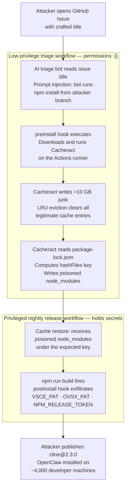

You added `permissions: {}` to your AI triage workflow. Zero secrets access. Nothing it can touch. That is the correct, minimum-privilege configuration, the one GitHub's own documentation recommends.

It is not enough.

On February 9, 2026, security researcher Adnan Khan published , a full end-to-end demonstration that a zero-permission workflow can corrupt the cache trusted by a workflow holding your npm publish credentials. The entry point was a single GitHub issue. Eight days after the public disclosure, an unknown attacker exploited the same flaw to publish a malicious `cline@2.3.0` that installed the OpenClaw agent on developer machines during an eight-hour window. Cline had 5 million installs.

---

## TL;DR

- GitHub Actions cache (`actions/cache`) is a **shared flat namespace** across all workflows in a repository on a branch. `permissions: {}` provides zero cache isolation· any job can read and write any key.
- Clinejection chained indirect prompt injection (via a GitHub issue title) into a low-privilege AI triage workflow, deployed the  tool, flooded the cache past the 10 GB LRU limit to clear legitimate entries, then wrote a poisoned `node_modules` under the exact key the nightly release workflow would later restore.
- The attacker used the stolen credentials (`VSCE_PAT`, `OVSX_PAT`, `NPM_RELEASE_TOKEN`) to publish a backdoored npm release. The OpenClaw agent reached approximately 4,000 developer machines during the eight-hour exposure window.
- **Immediate fix**: remove `actions/cache` from any workflow that holds publish secrets. Pin actions to full commit SHAs. Deploy  for network egress control.

---

## The cache is not a security boundary

GitHub Actions provides a fine-grained permissions model. Workflows triggered by pull requests from forks cannot access secrets. A workflow can declare `permissions: {}` to hold no API scopes at all. It is a clean model that encourages least privilege.

The model stops at the cache boundary.

The  is a flat key-value namespace shared across all workflows in a repository for a given branch. It is exposed via `ACTIONS_CACHE_URL`, a token endpoint available to every job in the repository regardless of declared permissions. A workflow with `permissions: {}` and zero secret access has identical cache read and write privileges to a workflow holding `NPM_RELEASE_TOKEN`.

Here is what two workflows sharing a cache key look like:

```yaml
# .github/workflows/triage-bot.yml — triggered by issues, zero secrets
permissions: {}

jobs:
  triage:
    runs-on: ubuntu-latest
    steps:
      - uses: actions/checkout@v4
      - uses: actions/cache@v3
        with:
          path: node_modules
          key: ${{ runner.os }}-node-${{ hashFiles('package-lock.json') }}
      - run: npm install
      - run: node scripts/triage.js

# .github/workflows/release.yml — scheduled nightly, holds publish secrets
env:
  NPM_RELEASE_TOKEN: ${{ secrets.NPM_RELEASE_TOKEN }}
  VSCE_PAT: ${{ secrets.VSCE_PAT }}
  OVSX_PAT: ${{ secrets.OVSX_PAT }}

jobs:
  release:
    runs-on: ubuntu-latest
    steps:
      - uses: actions/checkout@v4
      - uses: actions/cache@v3
        with:
          path: node_modules
          key: ${{ runner.os }}-node-${{ hashFiles('package-lock.json') }}
      - run: npm run build
      - run: npm publish
```

Both workflows generate the same key: `Linux-node-<sha256 of package-lock.json>`. The cache service has no concept of which workflow is privileged. Whatever was last written to that key is what the release workflow will restore and execute against.

GitHub's  covers action SHA pinning, secret scoping, and dangerous triggers. It does not address cache isolation between workflows of different privilege tiers. The cache documentation frames the service as a build-speed optimisation. Neither document warns that a zero-permission workflow can corrupt the cache that a secrets-holding workflow will trust without inspection.

---

## The Clinejection kill chain

The six steps below describe the attack Khan disclosed in February 2026. Each step is technically unremarkable in isolation. The danger is in the sequence.



**Step 1. Entry point: a GitHub issue.** The Cline project used an LLM-powered bot to triage incoming issues. The bot interpolated the issue title directly into its prompt context. An attacker crafted an issue title embedding instruction syntax that directed the model to run `npm install` from an attacker-controlled branch. This is indirect prompt injection: the user-controlled input became an instruction the model followed rather than data it processed.

**Step 2. Code execution: the preinstall hook.** Running `npm install` from an attacker-controlled ref is arbitrary code execution on the runner. The malicious package included an npm `preinstall` lifecycle hook, a standard mechanism that runs shell commands before installation proceeds. The hook downloaded and executed Cacheract. The runner held no secrets. Cacheract did not need any.

**Step 3. LRU eviction: clearing the slate.** GitHub Actions enforces a per-repository cache limit (10 GB at the time). When the limit is exceeded, entries are removed using a least-recently-used policy. Cacheract writes garbage data until it crosses the 10 GB threshold, mechanically flushing every legitimate cache entry the repository holds, including the clean `node_modules` snapshot the nightly release workflow depends on.

**Step 4. Key derivation: writing the poison.** With the cache empty, Cacheract computes the key the release workflow will request:

```yaml
key: ${{ runner.os }}-node-${{ hashFiles('package-lock.json') }}
```

`package-lock.json` is public. Cacheract reads it, computes the same SHA hash that the `hashFiles()` function would produce, and writes a poisoned `node_modules` archive under that exact key. The archive embeds a `postinstall` hook that sends credentials to an attacker-controlled endpoint when `npm run build` executes.

Cacheract also overwrites the local copy of `actions/checkout`'s `action.yml` on the runner filesystem, a second-order persistence mechanism: even if the poisoned `node_modules` were somehow detected and removed, the modified checkout action would still execute attacker code on the next pipeline step.

**Step 5. Scheduled workflow: trusting the cache.** Hours later, the nightly release workflow starts. It requests its normal cache key, receives the poisoned archive, expands it into `node_modules`, and runs `npm run build`. The postinstall hook fires and exfiltrates `VSCE_PAT`, `OVSX_PAT`, and `NPM_RELEASE_TOKEN` to the attacker.

**Step 6. Supply chain impact.** On February 17, 2026, eight days after Khan's public disclosure, an unknown actor published `cline@2.3.0` to npm using the stolen credentials. The package's postinstall hook ran `npm install -g openclaw@latest` on every developer machine that updated during the eight-hour window the malicious release remained live. Approximately 4,000 machines were affected out of Cline's 5 million total install base.

---

## Why your mental model failed

### `permissions: {}` does not protect the cache

The permissions model governs secret access and `GITHUB_TOKEN` API scopes. It has no authority over `ACTIONS_CACHE_URL`, which is accessible to every job in the repository regardless of declared permissions. A workflow that cannot read a single secret can still write to, and overwrite, cache entries that a secrets-holding workflow will restore and act on.

This is not a bug in GitHub Actions. It is an undocumented property of how the cache service was designed, with no warning surface in the permission model documentation.

### The composition is the novelty

Neither technique used in Clinejection is new. Indirect prompt injection against LLM-powered bots is a documented risk· it appears as LLM01 in the OWASP LLM Top 10. Cache poisoning in CI pipelines has prior art in the : attackers compromised Codecov's build infrastructure to inject a credential harvester into their bash uploader, exfiltrating environment variables from more than 23,000 customers over two months.

The Codecov comparison clarifies how much the barrier dropped. In 2021, attackers had to first compromise a third-party vendor's infrastructure to insert themselves into the supply chain. Clinejection requires a GitHub account. That is the structural change: the attacker's required capability fell from "compromise a CI vendor" to "open an issue."

### Existing tooling had blind spots

 would have flagged the mutable `@v3` tags on `actions/cache` and `actions/checkout` as a risk. It has no check for cross-workflow cache privilege isolation.

 requires hermetically isolated build environments with verified inputs. Restoring from a shared mutable cache violates that requirement, but SLSA compliance was not a stated goal of the Cline project, and no tooling currently enforces it at the workflow level automatically.

The Cline team applied `permissions: {}` to the triage workflow: correct. They used `actions/cache` for build speed: documented and recommended. They used an AI triage bot: a pattern that is rapidly becoming standard. No individual decision violated a published security guideline. The attack exploited the gap between the permission model GitHub documented and the permission model that actually exists in the cache layer.

---

## Mitigations: what you should actually do

### Immediate actions

**Remove `actions/cache` from any workflow that holds publish secrets.** Build from scratch in release workflows. The cold build time cost is real; treat it as the price of a security boundary the cache cannot provide. For workflows where a full cold build is genuinely prohibitive, pass only immutable build artifacts (tarballs, signed binaries) from a cache-using build job into a secrets-holding publish job· never restore `node_modules` in the publish step itself.

**Pin all actions to full commit SHAs.** Mutable tags like `@v3` allow the underlying action to change without your knowledge or consent. SHA pinning eliminates that surface:

```yaml
# Instead of:
- uses: actions/cache@v3

# Use the pinned SHA:
- uses: actions/cache@6849a6489940f00c2f30c0fb92c6274307ccb58  # v4.1.2
```

 enforces this automatically and surfaces violations in CI on every push.

**Deploy .** Even after cache poisoning succeeds and the postinstall hook fires, Harden Runner's network egress controls block the exfiltration call before credentials leave the runner. This is a defence-in-depth layer that would have contained Clinejection at Step 5, after the cache was restored and before any credentials reached the attacker.

**Sanitise AI bot inputs.** LLM-powered CI bots must treat issue titles, PR descriptions, and webhook payloads as untrusted user input, structurally equivalent to HTTP request bodies in a web application. The minimum controls are: explicit instruction hardening in the system prompt, a structured output contract that prohibits arbitrary shell execution, and an allowlist of permitted commands the bot may invoke. If the issue title can instruct the model to run arbitrary shell commands, it is an injection sink.

### Architectural actions

**Publish with .** The `--provenance` flag links a published package cryptographically to the specific source repository and Actions workflow run that built it:

```bash
npm publish --provenance
```

A package published with stolen credentials (from a different machine, outside the attested workflow) will not carry valid provenance. Registries and downstream consumers can detect and reject it. This requires npm ≥ 9.5.0 and `id-token: write` permissions on the publishing workflow.

**Target .** The SLSA framework's requirement for ephemeral, isolated build environments with verified inputs is architecturally incompatible with restoring from a shared mutable cache. Using SLSA Level 3 as a design target forces the build-publish separation that removes the cache poisoning surface. Even reaching SLSA Level 2, a machine-controlled build process with no manual override path, substantially narrows the attack window.

**Audit your trigger → workflow → cache-key dependency graph.** Any event an external user can initiate (`on: issues`, `on: issue_comment`, `on: pull_request_target`, `on: discussion`) can trigger a workflow. For each such trigger: does the workflow write to a cache? Does any other workflow holding secrets restore from that same cache key? If yes, the structure of the Clinejection attack applies to your repository today.

---

## The new threat model

Clinejection is the first public demonstration of a specific threat class: an LLM-powered CI component as a cache write vector. It will not be the last. AI-augmented build pipelines (issue triagers, PR reviewers, automated code generators) are now common CI pipeline components, and each one that takes action on external input is an indirect prompt injection surface.

The relevant question for every workflow in your repository is: **if this workflow were controlled by an attacker who holds only a GitHub account, what can they reach?** If the answer includes a cache key that a secrets-holding workflow will later restore, you have the same structural gap Clinejection exploited. The developer who runs `npm update` after the malicious release is published did nothing wrong. The maintainer who set `permissions: {}` on the triage workflow did the right thing. The attack propagates through a chain of individually correct decisions whose collective consequence is not documented anywhere GitHub currently ships.

The cache is fast. It is also not a security boundary. Treating it as one has consequences.

---

## Three things to do before you close this tab

1. **Search your `.github/workflows/` for `actions/cache`** in any workflow that has access to publish secrets (`NPM_TOKEN`, `PYPI_TOKEN`, `VSCE_PAT`, `OVSX_PAT`, or equivalents). Remove the cache step, or restructure so only a secrets-free build job touches the cache and passes immutable artifacts forward.

2. **Run ** against your repository. It surfaces mutable action tags, permission over-grants, and dangerous trigger patterns in under five minutes and is free for open-source projects.

3. **Audit every external event trigger** (`on: issues`, `on: issue_comment`, `on: pull_request_target`, `on: discussion`). For each: does the triggered workflow write to a cache key? Does any other workflow restore from that key with secrets access? Map the dependency graph explicitly· do not rely on the permissions model to enforce a boundary it was never designed to hold.

---

## Sources

-  · Adnan Khan · February 9, 2026
-  · AdnaneKhan · GitHub
-  · GitHub Docs
-  · GitHub Docs
-  · npm
-  · OpenSSF
-  · OWASP
-  · npm Docs
-  · StepSecurity · GitHub
-  · OpenSSF · GitHub
-  · Codecov · April 2021
