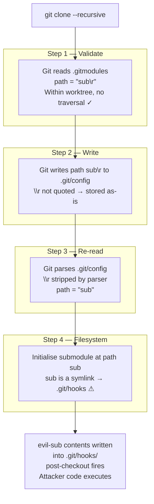

The command that compromised developer machines throughout late 2025 looks completely normal:

```bash
git clone --recursive https://github.com/legit-looking/project
```

Nothing in that invocation hints at the trap. Buried inside the cloned repository's `.gitmodules` file was a submodule path containing a single invisible character: a carriage return (`\r`, ASCII 0x0D). That one byte (invisible in terminals, invisible in most text editors, and passed silently by Git's validator) was enough to redirect submodule checkout into `.git/hooks/` and execute an attacker-controlled script with the developer's full local privileges.

This is  (CVSS 8.1 High, ), disclosed on July 8, 2025, and discovered by David Leadbeater during a security audit sponsored by G-Research Open Source. By August 25, 2025, CISA had added it to the · proof-of-concept exploits had appeared within days of public disclosure.

If you run Git on Linux or macOS and have not updated, you are affected. The patch landed across every active Git maintenance branch on July 8, 2025.

The fix, it turned out, was two words in the source: `|| value[i] == '\r'`. One condition. One bug. The rest of this post explains how a single invisible character unlocked all of that.

---

## TL;DR

- **CVE-2025-48384** (CVSS 8.1, GHSA-vwqx-4fm8-6qc9): a trailing `\r` in a `.gitmodules` submodule path exploits a read/write asymmetry in Git's config parser to achieve RCE on `git clone --recursive`.
- **Affected**: Linux and macOS. Windows is not directly affected· NTFS disallows `\r` in filenames, so the initial filesystem setup fails before the hook fires.
- **Amplified by**: GitHub Desktop for macOS, which passes `--recursive` by default, reducing exploitation to a single click on a repository link.
- **Patched**: Git v2.43.7, v2.44.4, v2.45.4, v2.46.4, v2.47.3, v2.48.2, v2.49.1, v2.50.1, all released July 8, 2025.
- **Actively exploited**: Added to CISA KEV on August 25, 2025.
- **Deeper lesson**: same vulnerability class as , validation and execution operating on different normalisations of the same value.

---

## The hidden asymmetry

Git's config parser has a quiet inconsistency that persisted undetected for years. When it **reads** a config value, the internal `get_next_char()` function silently strips any trailing carriage return. When it **writes** a config entry via `write_pair()`, values containing `\r` are not quoted or escaped. The character disappears on the next parse cycle.

This is what a non-idempotent serialisation round-trip looks like in practice: write a value, read it back, get something different. The fix Git applied was this addition to the `write_pair()` quoting check:

```c
/* Simplified: the condition that was missing */
if (v[i] == '\n' || v[i] == '\r' || /* other special chars */)
    /* quote the value */
```

Before the patch, a `\r` in a config value sailed through `write_pair()` unquoted. The next call to `get_next_char()` stripped it. The value written and the value read back were different strings.

For ordinary config values (branch names, remote URLs, user email), this asymmetry is harmless. A trailing carriage return in a user name is a cosmetic annoyance at worst. For **filesystem paths** in `.gitmodules`, the asymmetry is catastrophic. The  defines `submodule.<name>.path` as a working-tree-relative path that Git validates and then acts on. When the path used for validation and the path used for filesystem operations are different strings, you have a trapdoor.

The  describes how config values are parsed but does not enumerate which characters require quoting. The omission of `\r` from the quoting logic was the gap David Leadbeater found.

---

## The attack chain

An attacker assembles a repository with three deliberate components:

```
malicious-repo/
├── .gitmodules          ← declares submodule path "sub\r" (literal CR embedded)
├── sub -> .git/hooks    ← symlink named "sub" pointing to .git/hooks
└── evil-sub/            ← nested Git repo containing a post-checkout script
```

When a victim runs `git clone --recursive <malicious-repo>`:



**The validation and the write target the same string; the re-read target, one step later, is a different string.** Git validated `sub\r`. It then acted on `sub`. No memory corruption, no privilege escalation. Just a config parser that normalises on read but not on write.

| Step | Path seen | What happens |
|------|-----------|--------------|
| Validate | `sub\r` | Check passes — within worktree, no `..` |
| Write | `sub\r` | Written to `.git/config` with `\r` intact |
| Re-read | `sub` | CR stripped by `get_next_char()` |
| Act | `sub` | Symlink resolves to `.git/hooks` |
| Hook | — | `post-checkout` script executes |

The entire exploit turns on a three-character difference between what was checked and what was followed.

---

## Why this is a supply chain attack

The immediate threat model is a malicious repository posing as a legitimate open-source project. A developer follows a link from a README, a Slack message, or a package setup guide. They clone the repo. They get owned before writing a single line of code. CI systems, onboarding scripts, and build pipelines that automate `git clone --recursive` during bootstrap face the same exposure.

### The GitHub Desktop amplifier

GitHub Desktop for macOS passes `--recursive` automatically on every clone. This reduces the attack from a command-line operation to a single click on a repository link in a browser. The blast radius extends from security-aware engineers who scrutinise their clone flags to any macOS user who has GitHub Desktop installed. That's a much larger group.

At time of initial disclosure in July 2025, no patch had been released for the GitHub Desktop application itself. If you use GitHub Desktop on macOS, verify your installation version against the  and check whether the default clone behaviour has been changed.

### The transitive risk

The more insidious angle is transitive. A legitimate project A includes a legitimate project B as a submodule. Project B is quietly compromised via a maintainer credential theft, a typosquatted submodule URL, or a social-engineering maintainer takeover. Now every downstream consumer of project A who runs `git clone --recursive` inherits the RCE gadget, with no indication of compromise visible in project A's own repository.

This attack vector requires no zero-day. Write access to one node in the submodule graph is enough. And because the malicious hook fires silently during the clone operation itself, the developer has no opportunity to inspect the code before it runs.

---

## Checking and fixing your exposure

### Update Git first

Upgrade to any of the patched versions released on July 8, 2025:

| Branch | Patched version |
|--------|-----------------|
| 2.43.x | v2.43.7 |
| 2.44.x | v2.44.4 |
| 2.45.x | v2.45.4 |
| 2.46.x | v2.46.4 |
| 2.47.x | v2.47.3 |
| 2.48.x | v2.48.2 |
| 2.49.x | v2.49.1 |
| 2.50.x | v2.50.1 |

```bash
# macOS (Homebrew)
brew upgrade git

# Debian / Ubuntu
apt-get update && apt-get upgrade git

# Fedora / RHEL / CentOS
dnf upgrade git

# Verify
git --version
```

Many Docker base images and CI runners lag months behind upstream releases. Do not assume your CI environment is patched· check explicitly.

### Inspect `.gitmodules` before recursive clone

For any repository you do not control, inspect before recursing:

```bash
# Clone without submodules first
git clone --no-recurse-submodules <repo-url>
cd <repo>

# cat -A renders \r as ^M — look for it on path lines
cat -A .gitmodules | grep "path"

# Hex dump for unambiguous inspection
grep "path" .gitmodules | xxd | head -40
```

A legitimate repository has no reason to embed carriage returns in submodule path values. Any `^M` in a path line should be treated as hostile. Stop there; do not proceed with `git submodule update`.

### CI/CD pipeline checklist

- **Audit every `git clone --recursive`** call that targets an external repository. Flag ones with no integrity check.
- **Pin submodule references to commit SHAs**, not branch names. A compromised maintainer cannot retroactively alter the content at a specific SHA.
- **Prefer `git submodule update --init`** (without `--recursive`) at clone time to allow inspection of the top-level submodule list before recursing into nested dependencies.
- **Verify Git versions in CI images.** Add a step that fails the build if `git --version` returns an unpatched release.
- **Consider SLSA level 2+ requirements** for third-party submodules, which enforce provenance attestation and make unauthorised content substitution detectable.

---

## The deeper pattern

CVE-2025-48384 is not a novel class of bug. It is structurally identical to , a CVSS 9.0 Critical vulnerability patched in May 2024 via Git 2.45.1. Both share the same attack skeleton:

1. A crafted submodule path exploits a normalisation gap between what is validated and what is acted on.
2. A symlink redirects submodule checkout to `.git/hooks/`.
3. A hook script executes attacker-controlled code.

The only difference is the **bypass mechanism**. CVE-2024-32002 used case-folding on case-insensitive filesystems· `Sub` and `sub` are the same directory on HFS+ or NTFS, so a path like `Sub/../.git` slipped through the check that blocked `.git` as a path component. CVE-2025-48384 used CR-stripping· `sub\r` at validation becomes `sub` at execution. Same skeleton, different invisible character, different platform scope.

The family tree goes further back: `.git` directory smuggling attacks (where a crafted tar or zip archive embedded a `.git` directory that bypassed checks operating only on top-level entries) share the same property. In every case, validation happens at one representation of a value and execution happens at a different, normalised representation of the same value.

**The principle for tooling authors**: if a user-controlled string passes through any normalisation step between validation and execution (case folding, whitespace stripping, encoding normalisation, Unicode decomposition, newline canonicalisation), the pre- and post-normalisation forms are both attack surfaces. Validate the form you will act on, or ensure your normalisation is transparent and idempotent in both directions.

The fix for CVE-2025-48384 is instructive: the bug was not in the validation logic, which was correct. It was in the serialisation logic, which silently assumed `\r` was safe to pass through unquoted. Correctness assumptions about parsing need to be stated and enforced explicitly, not inherited from adjacent code that happens to strip the problematic characters on its own.

---

## The one-byte lesson

A carriage return is 0x0D, one byte that terminals swallow silently, editors rarely display, and Git's validator never questioned. The attack works precisely because no single component appears broken in isolation: the validator correctly checks the input it receives; the parser correctly strips `\r` from what it reads; the filesystem correctly follows the symlink it is pointed to. The vulnerability lives in the seam between them, in the assumption that what is written and what is read back are the same thing.

CVE-2025-48384 was added to the CISA Known Exploited Vulnerabilities catalog less than seven weeks after disclosure. Patch on Tuesday, weaponised exploit by Thursday, KEV entry within the month. That's the supply chain threat model made concrete.

Update your Git installation. Inspect `.gitmodules` files before recursive clones. Audit your CI pipelines for unguarded `--recursive` calls against third-party repositories. And the next time you review a parser that reads back what it writes, ask explicitly whether the round-trip is idempotent, because sometimes the answer is "no," and sometimes the consequence is RCE from a single invisible character.

---

## Sources

-  · NIST National Vulnerability Database · CVSS 8.1 High
-  · GitHub
-  · Taylor Blau · OpenWall oss-security mailing list
-  · David Leadbeater (discoverer) · G-Research Open Source
-  · Datadog Security Labs
-  · git/git · GitHub
-  · NIST National Vulnerability Database · CVSS 9.0 Critical
-  · git-scm.com
-  · git-scm.com
-  · CISA/NIST
