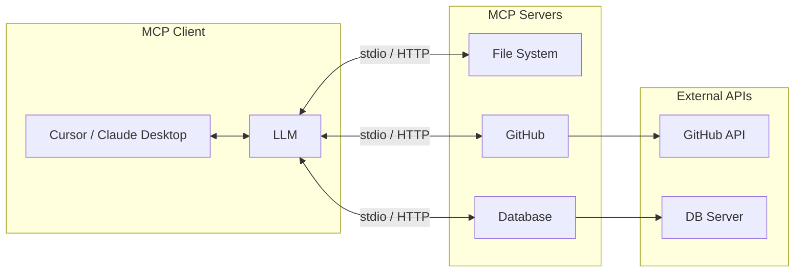
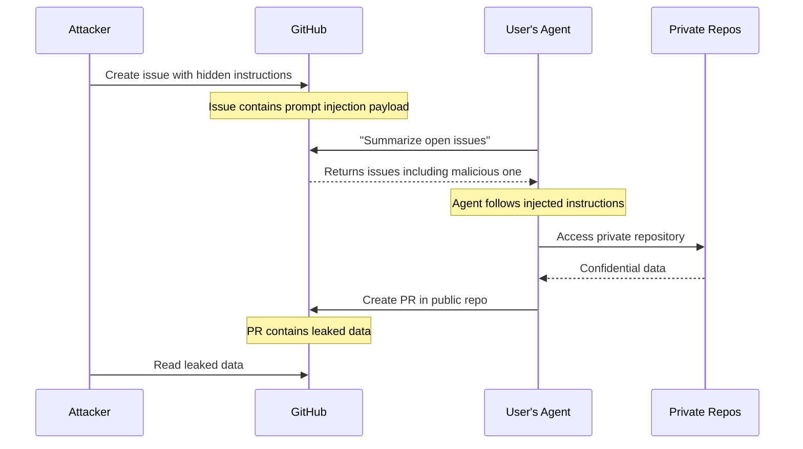

The Model Context Protocol was supposed to be the "USB-C for AI applications"· a universal standard letting AI agents safely connect to any tool or service. Instead, it's become a security nightmare. In the first half of 2025 alone, we saw five critical CVEs, multiple data exfiltration incidents, and academic research showing a 36.5% average attack success rate against state-of-the-art LLM agents.

This article examines why MCP is insecure by design, documents the real-world attacks that have already occurred, and provides concrete hardening strategies for securing your AI agent infrastructure.

## What is MCP?

MCP (Model Context Protocol) is an open protocol created by Anthropic in November 2024. It standardizes how AI applications connect to external tools and data sources. Before MCP, building agents meant wrestling with different frameworks, operating parameters, and LLM-specific integrations. MCP solved this by providing a single protocol for all agentic communication.

The architecture is straightforward:

- **MCP Client**: Applications like Claude Desktop, Cursor IDE, or custom chatbots
- **MCP Server**: Services exposing tools (file system access, GitHub, databases, etc.)
- **LLM**: The language model deciding which tools to call
- **Transport**: Either stdio (local) or streamable HTTP (remote)

When you connect an MCP server to your client, the LLM gains access to whatever tools that server exposes. A file system MCP server gives the LLM read/write access to your disk. A GitHub MCP server lets it create issues, read repositories, and merge pull requests.

This power comes with a cost: the attack surface is enormous.

## The Attack Surface

MCP creates security challenges at every layer of the stack.

### Server-Side Vulnerabilities

MCP servers are essentially plugins, and they inherit all the classic plugin security problems:

**Authorization failures**: Many MCP servers don't validate whether the calling user should have access to the resource being requested. If your LLM can call a PostgreSQL MCP server, it can potentially run any query, including `DROP TABLE`.

**Credential exposure**: Servers often store  keys and credentials. A prompt injection attack can trick the LLM into requesting these credentials directly.

**Authentication bypasses**: Servers may not consistently authenticate requests, especially when running locally over stdio.

### Client-Side Vulnerabilities

The client is where the LLM makes decisions about which tools to call:

**Prompt injection**: Malicious input can hijack the LLM's reasoning process and make it call tools it shouldn't.

**Tool poisoning**: An attacker can register a malicious MCP server with tools that have deceptive descriptions, tricking the LLM into calling them.

**Session hijacking**: If session tokens aren't properly managed, attackers can take over existing connections.

### Transport Vulnerabilities

Both local (stdio) and remote (HTTP) transports have issues:

**0.0.0.0 binding**: Many local MCP servers bind to all interfaces by default, exposing them to network attacks.

**DNS rebinding**: Attackers can use DNS tricks to make browsers connect to localhost services.

**Missing TLS**: Some remote MCP implementations don't enforce encrypted connections.

## Real-World Attacks

These aren't theoretical risks. Here's what has already happened.

### CVE-2025-49596: MCP Inspector RCE

In April 2025,  in MCP Inspector· Anthropic's official debugging tool for MCP servers. The flaw had a CVSS score of 9.4.

The attack was elegant and devastating. MCP Inspector runs a proxy server that binds to `0.0.0.0:6277` by default. It accepts arbitrary stdio commands without authentication. An attacker could create a malicious website, wait for a developer to visit it, and the embedded JavaScript would send commands to the proxy, achieving full code execution on the developer's machine.

Internet-wide scanning revealed over 560 exposed MCP Inspector instances. Major tech companies including Microsoft and Google were using the tool.

The fix, released in version 0.14.1, added session tokens and bound services to localhost only. But for months, every developer running MCP Inspector was one browser tab away from full compromise.

### CVE-2025-6514: mcp-remote Command Injection

 in `mcp-remote`, a popular package with over 437,000 downloads. The CVSS score was 9.6.

The vulnerability exploited the  authentication flow. When a user authenticated, the package would pass user-controlled data directly to a shell command without sanitization. An attacker could craft a malicious  response that executed arbitrary commands.

The scope was enormous; every system that had used mcp-remote for  authentication was potentially compromised.

### GitHub MCP Data Exfiltration

 how a single malicious GitHub issue could exfiltrate private repository data through the official GitHub MCP integration (14,000+ stars on GitHub).

The attack worked like this:

1. Attacker creates a GitHub issue containing hidden prompt injection instructions
2. User asks their agent to "summarize open issues"
3. Agent reads the malicious issue, which instructs it to access private repositories
4. Agent pulls confidential data into context
5. Agent leaks the data by creating a pull request in a public repository

Through this single vector, attackers could access private repository contents, personal financial data, and organizational secrets. The attack exploited something the MCP spec explicitly warns about but provides no mechanism to prevent: servers being untrusted threat actors.

## Tool Poisoning: The Numbers

Academic research has quantified how vulnerable LLM agents actually are to tool poisoning attacks.

The  tested 45 real-world MCP servers with 353 authentic tools across 1,312 malicious test cases. The results are sobering:

| Model | Attack Success Rate |
|-------|---------------------|
| o1-mini | 72.8% |
| Average (20 LLMs) | **36.5%** |
| Safety refusal rate | <3% |

The most alarming finding: more capable models were often more susceptible. The attacks exploit superior instruction-following abilities, the very feature that makes advanced models useful.

> **Warning:** Existing safety mechanisms proved almost completely ineffective. Claude 3.7 Sonnet, the one of the most safety-aligned models back then, refused malicious tool poisoning attacks less than 3% of the time. The attacks don't look malicious to the model because they use legitimate tools for unauthorized operations.

Follow-up research with MCP-ITP (Implicit Tool Poisoning) achieved even higher attack success rates (up to 84.2% ), while suppressing malicious tool detection to as low as 0.3%.

## Why MCP is Insecure by Design

These vulnerabilities aren't bugs, they're consequences of design decisions.

**Security wasn't a priority**: The MCP specification focuses on ease of use and interoperability. Security features like  2.1 support were added later and remain optional. Most real-world implementations skip them entirely.

**Trust model is fundamentally broken**: The spec treats MCP servers as potentially malicious, but provides no enforcement mechanism. It's like locking your door but leaving a sign that says "key under the mat."

**No isolation by default**: MCP servers run with whatever permissions the host process has. There's no sandboxing, no capability restrictions, no way to limit what a tool can actually do.

**Human approval is optional**: The spec recommends human-in-the-loop for sensitive operations, but implementations can bypass this entirely. Many do.

**Tool descriptions are trusted**: LLMs make decisions based on tool descriptions provided by MCP servers. If a malicious server lies about what its tools do, the LLM has no way to verify.

## Hardening Your MCP Deployment

Despite these structural issues, you can significantly reduce risk.

> **Tip:** The most effective defense is sandboxing. Research shows sandboxing has a bypass rate of less than 5%, compared to 30-40% for input validation and 60-70% for output filtering.

### Deploy an MCP Gateway

Put a security gateway between your clients and MCP servers. A gateway can:

- Enforce authentication and authorization
- Validate tool signatures and descriptions
- Inject credentials just-in-time instead of storing them on servers
- Log all tool invocations for audit
- Block suspicious request patterns

### Use OAuth 2.1 with Short-Lived Tokens

Don't use static API keys. MCP . Use it. Configure:

- Short token lifetimes (minutes, not days)
- Narrow scopes per tool
- Token rotation on every session

### Apply Least Privilege Ruthlessly

For every MCP server you connect:

- Does it need write access? Remove it if not.
- Does it need access to all repositories? Restrict to specific ones.
- Does it need to run shell commands? Almost certainly not.

### Scan Your MCP Servers

Several tools can detect vulnerabilities:

- **MCP-Scan** (Invariant Labs): CLI-based static/dynamic scanning
- **MCPSafetyScanner**: Agentic security auditor, scans servers in under a minute
- **NeuralTrust MCP Scanner**: Multi-category vulnerability detection

Run scans before deploying any MCP server and periodically afterward.

### Monitor for Tool Poisoning

Watch for:

- Tool description changes between sessions
- Unexpected tool invocations
- Access to resources outside normal patterns
- Data exfiltration attempts (large responses, external URLs)

### Implement Approval Workflows

For sensitive operations, such as file writes, code commits, and database changes require human approval. Yes, this reduces automation. It also prevents a prompt injection from emptying your production database.

### Sandbox Where Possible

Run MCP servers in containers or VMs with restricted network access. If a server is compromised, limit the blast radius.

## The Path Forward

MCP adoption is accelerating despite the adoption of Skills. Microsoft, Google, Cloudflare, and countless startups are building on it. The convenience is real and the security risks are equally real.

The MCP specification is evolving. Recent updates include stronger authorization models and better security guidance. But security by default isn't there yet, and the existing deployment base won't automatically upgrade.

If you're using MCP today:

1. Audit every connected MCP server
2. Deploy a gateway for centralized security policy
3. Implement comprehensive logging
4. Assume servers are malicious · because some of them might be

The "USB-C for AI" vision is compelling. But USB-C doesn't give connected devices root access to your machine. Until MCP builds in the security guarantees that vision requires, treat every connection as a potential threat.
