This is the payload that made any anonymous user a CouchDB administrator in 2017:

```json
{
  "type": "user",
  "name": "attacker",
  "password": "secret",
  "roles": ["_admin"],
  "roles": []
}
```

One HTTP PUT. No credentials. Full admin access.

The bug was not a missing bounds check or a logic error in the auth code. It was a single word in the JSON specification: **SHOULD**.

---

## The Specification That Shrugged

, the current JSON standard, says this in Section 4:

> "The names within an object SHOULD be unique."

In IETF terminology, SHOULD has a precise definition: there may be valid reasons to deviate, but the implications must be understood. It is explicitly not MUST, not a hard requirement. The same RFC goes further and acknowledges the practical fallout:

> "When the names within an object are not unique, the behavior of software that receives such an object is unpredictable. Many implementations report the last name/value pair only. Other implementations report an error or fail to parse the object, and some implementations report all of the name/value pairs, including duplicates."

The specification authors knew parsers would diverge. They documented it. They kept the permissive wording anyway, to avoid breaking JavaScript's early `eval()`-based parsing, which had already established last-wins semantics. Every subsequent RFC revision preserved this choice.

A parser author reading the specification today is technically compliant if they accept duplicate keys and do anything at all with them.

---

## Four Behaviors, One Format

 surveyed 49 JSON parsers across 10 programming languages and found four distinct behaviors for duplicate keys:

| Behavior | What happens | Example |
|----------|-------------|---------|
| **Last-wins** | Final value for a key takes precedence | Python `json`, Go `encoding/json`, V8 |
| **First-wins** | First value for a key takes precedence | Some Erlang configurations, some Java parsers |
| **Collect-all** | All values aggregated into an array | Some XML-to-JSON translators |
| **Strict reject** | Parse fails on any duplicate | `simplejson` in strict mode, most schema validators |

The implication reaches beyond language boundaries. Parsers within the same language can disagree. Python's standard library `json.loads()` silently applies last-wins. `simplejson`, a widely used drop-in replacement, can be configured to reject duplicates entirely. An application that validates with one library in tests but deploys behind an  gateway using a different one has introduced a differential without realizing it, and the research found that every language in the survey had at least one parser with risky interoperability behavior.

---

## How CouchDB Was Exploited

Apache CouchDB split its document handling across two runtimes. The request ingestion and validation layer was written in Erlang. The document storage and permission enforcement layer used a JavaScript (SpiderMonkey) engine. Each runtime applied its own duplicate-key semantics independently.

When a client PUT the payload above to the `_users` endpoint, an endpoint that required no authentication for user creation at the time, the two runtimes diverged:

```
Incoming payload:
{
  "roles": ["_admin"],   ← first occurrence
  "roles": []            ← second occurrence
}

Erlang validation layer   (last-wins):
  reads  roles = []       ← empty array, valid for a regular user
  result: PERMIT the write

JavaScript enforcement layer   (first-wins):
  reads  roles = ["_admin"]   ← admin role
  result: STORE and ENFORCE as administrator
```

The document was written without authorization. Every subsequent operation treated the account as a CouchDB administrator.

```mermaid
flowchart TD
    A["Attacker\nPUT /users { roles:[_admin], roles:[] }"]
    A --> E

    subgraph couchdb["CouchDB"]
        E["Erlang Validation Layer\nlast-wins → roles = &#91;&#93;\n✓ PERMIT write"]
        E --> J["JavaScript Enforcement Layer\nfirst-wins → roles = &#91;_admin&#93;\n⚠ STORE as administrator"]
    end

    J --> D[("User record\nstored with _admin role")]
```



This was , CVSS 9.8 Critical, affecting Apache CouchDB before 1.7.0 and before 2.1.1. It was immediately chained with , which allowed an authenticated CouchDB administrator to execute arbitrary OS commands via configuration updates. The combined chain: one unauthenticated request creates an admin account; the admin account triggers remote code execution; full server compromise.

The  amounted to a handful of lines: enforce key uniqueness in the Erlang validation layer so both runtimes always see the same effective document.

---

## The Architecture That Makes This Repeatable

CouchDB's two runtimes were visible inside a single product. In most systems, the equivalent split is invisible: a "fat"  gateway in front of "thin"  behind it.



```mermaid
flowchart LR
    A["Attacker"] --> G

    subgraph perimeter["Perimeter"]
        G["API Gateway\nstrict parser\nlast-wins → roles = &#91;&#93;\n✓ PERMIT"]
    end

    G --> S

    subgraph backend["Backend"]
        S["Microservice\nlenient parser\nfirst-wins → roles = &#91;_admin&#93;\n⚠ STORED as admin"]
    end
```

The gateway validates using its parser's semantics. The service stores and enforces using different semantics. No single component is broken· the vulnerability lives in the disagreement between them. A WAF that uses strict duplicate-key rejection does not protect a backend that uses lenient parsing; the WAF and the backend are not speaking the same language about what the document contains.

The pattern extends beyond simple authorization fields:

** claims**: Libraries in different languages apply the same four-behavior taxonomy to duplicate `alg` or `sub` claims. A token validation library that reads `alg: none` from a first occurrence while a backend reads a legitimate algorithm from a last occurrence is the mechanism behind several algorithm confusion attacks documented after 2017.

** and XML**: Parser-differential attacks on XML predate JSON by a decade. The same structural pattern, where a document traverses multiple parsers each with distinct behavior for ambiguous constructs, was exploited extensively in SAML implementations. JSON duplicate keys are the modern incarnation of the same flaw.

**Number representation**: Parsers disagree on integer versus float representation and overflow handling. A payment amount that overflows to a different integer in a downstream parser is a business-logic bypass with no duplicate keys required, just two parsers applying different numeric semantics to the same bytes.

---

## What Attackers Look For

The recon is mechanical. An attacker probing for split-parser architectures submits requests to security-sensitive endpoints with duplicate-key payloads targeting high-value fields:

```json
{ "roles": ["_admin"], "roles": [] }
{ "admin": true, "admin": false }
{ "is_superuser": true, "is_superuser": false }
{ "scopes": ["write:all"], "scopes": [] }
{ "permissions": ["*"], "permissions": [] }
```

The response pattern is diagnostic:

- **400 from the gateway**: the gateway applied strict parsing. No payload reached the backend.
- **200 from gateway, 400 from backend**: the gateway passed the document; the backend rejected it. The two parsers agree that duplicates are invalid, but disagree on where to enforce.
- **200 from both, with observed privilege elevation**: the attack succeeded. The gateway permitted based on one key occurrence; the backend enforced based on another.

Direct access to backend services (via misconfigured network rules, SSRF, or a gateway bypass) removes the first tier of uncertainty. If a service is reachable without the gateway, the attacker tests the backend parser directly and the gateway's posture becomes irrelevant.

---

## Fixing It

The correct posture is rejection, not tolerance. Configure every parser on every trust boundary to fail on duplicate keys as a hard error.

**Python**: the standard library provides no built-in duplicate rejection, but the `object_pairs_hook` parameter receives all key-value pairs before dict construction, including duplicates:

```python
import json

def reject_duplicates(pairs):
    seen = {}
    for k, v in pairs:
        if k in seen:
            raise ValueError(f"Duplicate key: {k!r}")
        seen[k] = v
    return seen

data = json.loads(payload, object_pairs_hook=reject_duplicates)
```

Without this hook, `json.loads()` silently applies last-wins. The hook is the only detection point in the standard library.

**Go**: `encoding/json` applies last-wins silently. `DisallowUnknownFields()` does not help here: it rejects unexpected struct fields but does not detect duplicate keys before struct assignment occurs. A schema validation layer above the decoder is the recommended approach for Go services handling untrusted input at trust boundaries:

```go
import (
    "encoding/json"
    "bytes"
)

func decode(payload []byte, target any) error {
    dec := json.NewDecoder(bytes.NewReader(payload))
    dec.DisallowUnknownFields()
    // encoding/json still applies last-wins for duplicates;
    // run a JSON Schema validator before this step for security-sensitive paths
    return dec.Decode(target)
}
```

**Schema validation** is a secondary control, not a primary one. A schema validator adds a useful layer, but only if the validator and the application parser use the same underlying library. Validating with library A and executing with library B recreates the original differential.

**Integration testing** is where you're most likely to catch this class of vulnerability before production. Unit tests using mocked parsers cannot detect inter-parser differentials. Integration tests must exercise the full parse stack with adversarial inputs: duplicate-key payloads for every security-sensitive field, submitted against each tier independently and end-to-end.

**Architectural principle**: the threat model must account for every parser on the payload's path. In an  design review, map the parse stack explicitly:

```
client → gateway parser → middleware parser → application parser → storage serializer
```

Any hop across a language boundary or library boundary is a potential differential point. The  calls for validation at every trust boundary, not just entry points. Parser-differential attacks succeed precisely because teams treat the gateway as the only trust boundary and assume all downstream components see the same document that the gateway validated.

The CouchDB mistake lives on, not in CouchDB (which patched it in November 2017), but in every system whose architects assumed "JSON" is a single, unambiguous thing.

---

## TL;DR

-  §4 says object keys **SHOULD** be unique, not MUST. All four divergent parser behaviors (first-wins, last-wins, collect-all, strict-reject) are spec-compliant. The RFC authors knew and documented this.
- CVE-2017-12635 (CVSS 9.8 Critical) exploited the gap between CouchDB's Erlang validation layer (last-wins) and its JavaScript enforcement layer (first-wins) to grant admin access in a single unauthenticated HTTP request. Chained with CVE-2017-12636, the result was full server compromise.
- Any multi-parser pipeline (API gateway + microservice, JWT validator + application, WAF + backend) is structurally exposed until every parser on the path is configured to **reject duplicate keys as a hard error**.

---

## Sources

-  · IETF STD 90, Section 4
-  · NIST, CVSS 9.8 Critical
-  · NIST, CVSS 8.8 High
-  · Apache Software Foundation (November 2017)
-  · Jake Miller, Bishop Fox (February 2021)
-  · Python Software Foundation
-  · Go standard library
-  · OWASP
