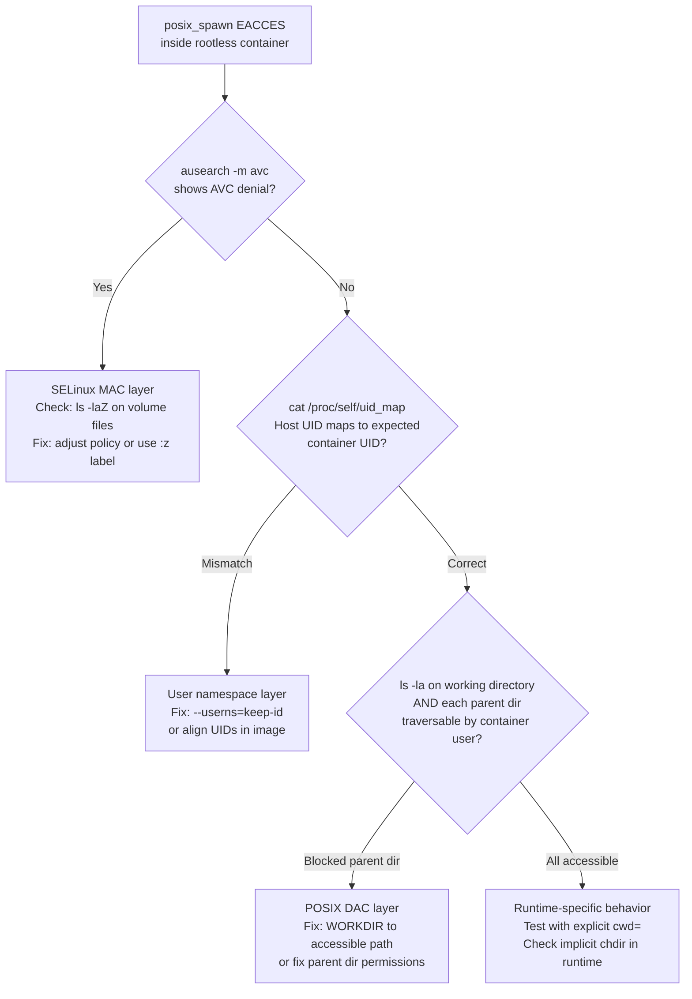

**TL;DR:** When a process spawned inside a rootless Podman container returns `EACCES`, three independent permission systems can each be the culprit: POSIX DAC (file ownership and mode bits), SELinux MAC (MCS category labels), and Linux user namespace UID mapping. They produce identical errors. Diagnosing the wrong layer wastes hours — and getting the SELinux label wrong (`‌:Z` vs `:z`) permanently shifts file ownership on the host.

---

## The Error That Lies

```
EACCES: permission denied, posix_spawn '/bin/echo'
    path: "/bin/echo",
 syscall: "posix_spawn",
   errno: -13,
    code: "EACCES"
```

This error appeared in a Bun HTTP server running inside a rootless Podman container. The diagnosis looked obvious: the container user can't execute `/bin/echo`. Except:

- `/bin/echo` has mode `755`. The container user is `runner` (uid 1001). File permissions are fine.
- `ausearch -m avc -ts recent` returns nothing. No SELinux denial.
- Seccomp isn't blocking `execve` — the Bun server itself started, which proves it.
- Even `/usr/local/bin/bun` — the same binary already running as the parent process — fails when `Bun.spawn()` tries to launch it as a child.

Every binary fails. The error names different paths but the result is always the same `EACCES`.

The error message lies. `posix_spawn EACCES` does not mean the binary can't be executed. It means something in the spawn sequence failed. That sequence is longer than most people assume, and it runs through three independent permission systems before `execve()` is ever reached.

---

## The Environment

The setup that surfaces all three issues:

- **Host:** Fedora 43 Server, SELinux enforcing, rootless Podman
- **Base image:** `oven/bun:slim` (Bun 1.3.12, Debian-based)
- **Application:** Bun HTTP server that spawns `claude` CLI as a child process per request
- **Container user:** `runner` (uid 1001), created via `RUN useradd -m runner`
- **Host user:** `keep` (uid 1000), owns the Podman session
- **Deployment:** systemd Quadlet (`.container` file)

```dockerfile
FROM claude-runner  # oven/bun:slim + claude CLI

RUN useradd -m runner
COPY server.ts /app/server.ts
ENV HOME=/home/runner
USER runner
EXPOSE 3000
ENTRYPOINT ["bun", "run", "/app/server.ts"]
```

```typescript
// The spawn that fails
const proc = Bun.spawn(["claude", "-p", prompt], {
  stdout: "pipe",
  stderr: "pipe",
  env: { ...Bun.env },
});
```

Three separate bugs surface across three layers during debugging. Each produces `EACCES`. Each requires a completely different fix.

---

## System 1: POSIX DAC — The Hidden chdir

### What posix_spawn actually does

`Bun.spawn()` doesn't call `execve()` directly. It goes through Bun's posix_spawn implementation (`src/bun.js/bindings/bun-spawn.cpp`), which performs these steps in the child process before the binary is ever reached:

1. Call `chdir()` to the working directory
2. Set up file descriptors, rlimits, and signal masks
3. Call `execve()`

The `chdir()` happens **before** `execve()`. When no `cwd` option is passed to `Bun.spawn()`, Bun sets the working directory from the current process's `top_level_dir` — the inherited WORKDIR from the container image. If `chdir()` fails, the error surfaces as `posix_spawn EACCES` with the binary path in the error message, even though the binary was never attempted. The error names the intended destination, not the point of failure.

### The trigger

`oven/bun:slim` sets `WORKDIR /home/bun/app`. The parent directory `/home/bun` has mode `700`, owned by `bun` (uid 1000). The `runner` user (uid 1001) cannot search (traverse) `/home/bun`, so `chdir("/home/bun/app")` fails with `EACCES`.

The parent Bun server starts fine because the container runtime sets the working directory via an inherited file descriptor before privileges are dropped — no path traversal required at startup. Every subsequent `Bun.spawn()` call, however, performs a fresh `chdir()` in the child process, which does require traversal permission on each path component.

The evidence is isolatable with three commands:

```bash
# Direct exec — no chdir involved, works:
podman run --rm --user 1001:1001 oven/bun:slim /bin/echo test

# Bun.spawn — implicit chdir to /home/bun/app, fails:
podman run --rm --user 1001:1001 oven/bun:slim \
  bun -e "Bun.spawn(['/bin/echo','test'])"

# Bun.spawn with explicit safe cwd — works:
podman run --rm --user 1001:1001 oven/bun:slim \
  bun -e "Bun.spawn(['/bin/echo','test'],{cwd:'/tmp'})"
```

The first succeeds because `podman exec` / direct invocation sets up cwd without traversal. The third succeeds because `/tmp` is world-writable. The second fails because uid 1001 cannot search `/home/bun/`.

### The fix

Add `WORKDIR` after switching to the non-privileged user:

```dockerfile
USER runner
WORKDIR /home/runner
```

This changes the working directory to `/home/runner`, which `useradd -m` creates with mode `755` and `runner:1001` ownership. `Bun.spawn()`'s implicit `chdir()` now succeeds.

### The diagnostic insight

When debugging `posix_spawn EACCES`, checking the binary's permissions is the wrong first step. Check the **working directory** and every **parent directory in its path** for the spawning user. Mode `700` on a home directory is set by `useradd` by default — correct behavior for a normal user, invisible during code review, fatal for a non-owner trying to traverse it as a path component.

---

## System 2: SELinux MAC — What :Z Actually Does to Your Files

### Mandatory access control is a separate layer

SELinux Mandatory Access Control operates independently of POSIX DAC. The kernel runs both checks, and either can deny access. On Fedora with SELinux enforcing and the default container policy, a bind-mounted volume needs an SELinux context that container processes are allowed to read.

Podman provides two relabeling options. They behave very differently.

### :Z — exclusive MCS category

The uppercase `:Z` tells Podman to relabel the volume with a **private, exclusive MCS category**. A Multi-Category Security label looks like `unconfined_u:object_r:container_file_t:s0:c124,c967`. The `c124,c967` suffix is the exclusive category pair — only the container process whose label matches exactly can access the volume. Other containers are denied even if they escape confinement.

`:Z` also relabels all files in the volume on the host filesystem. In a rootless Podman session with a user namespace active, this relabeling operation shifts file ownership from the host uid (1000) to the mapped subuid in Podman's user namespace range:

```bash
# Before mounting with :Z
stat -c '%u:%g %n' /home/keep/.claude
# 1000:1000 /home/keep/.claude

# After mounting with :Z in rootless Podman
sudo stat -c '%u:%g %n' /home/keep/.claude
# 525288:525288 /home/keep/.claude
```

The ownership shift is destructive and persists after the container stops. The original owner (`keep:1000`) can no longer access their own files. Other containers or host processes that expect uid 1000 ownership stop working. The `ausearch -m avc` audit log shows nothing — the shift isn't an SELinux denial, it's a relabeling operation that succeeded. The resulting access failures look like POSIX DAC problems.

### :z — shared label

The lowercase `:z` relabels the volume with the shared type `container_file_t` but without MCS categories: `unconfined_u:object_r:container_file_t:s0`. Any container can access a `:z`-labeled volume. File ownership on the host is not modified.

The security tradeoff is isolation: with `:z`, a compromised container could reach volumes mounted the same way by other containers. For credential files shared between containers or accessed from the host, this is the correct choice. For volumes that must be isolated to a single container, `:Z` is appropriate — but not in a rootless user namespace context where ownership shifts are destructive.

After discovering `:Z`-shifted ownership, restore the host files:

```bash
sudo chown -R 1000:1000 /home/keep/.claude /home/keep/.claude.json
```

Then switch to `:z` in the Quadlet:

```ini
Volume=/home/keep/.claude:/home/bun/.claude:z
Volume=/home/keep/.claude.json:/home/bun/.claude.json:z
```

### The label reference

| Label | SELinux effect | Ownership effect | Use when |
|-------|----------------|-----------------|----------|
| `:Z` | Exclusive MCS category per container | Shifts host ownership in rootless userns | Single container, no user namespace |
| `:z` | Shared `container_file_t`, no categories | No ownership change | Multiple containers or rootless userns |
| (none) | Inherits host SELinux context | No change | May cause AVC denials with enforcing policy |

---

## System 3: User Namespaces — The UID Translation Layer

### How rootless Podman maps UIDs

Rootless Podman runs without host privileges by using Linux user namespaces. The kernel translates UIDs between the container's view and the host according to a mapping table in `/proc/self/uid_map`.

The default mapping for a host user `keep` (uid 1000), viewed from inside the container:

```
# cat /proc/self/uid_map (default rootless, no keep-id)
         0          1       1000    # container  0–999  → host    1–1000
      1000          0          1    # container 1000    → host    0 (root)
      1001       1001      64536    # container 1001+   → host 1001+
```

Following the first range: host uid 1 → container uid 0, host uid 2 → container uid 1, …, host uid 1000 → container uid **999**. Files on the host owned by `keep:1000` appear inside the container as uid `999` — a uid that typically has no entry in the container's `/etc/passwd` and no relationship to any container user.

A container process running as `bun:1000` trying to access those files sees uid `999` and DAC denies it, even though the host user owns the files.

### --userns=keep-id

The `--userns=keep-id` flag adjusts the mapping so the host user's UID is preserved inside the container:

```
# cat /proc/self/uid_map (with --userns=keep-id)
         0          1       1000    # container  0–999  → host    1–1000
      1000       1000          1    # container 1000    → host 1000  ← changed
      1001       1001      64536    # container 1001+   → host 1001+
```

Now host uid 1000 (`keep`) maps to container uid 1000 (`bun`). Files from `/home/keep/` appear owned by `bun:1000` inside the container. Because `oven/bun:slim` already has a `bun` user at uid 1000, the alignment is natural — no UID juggling in the Dockerfile required.

`--userns=keep-id` is not a Quadlet-native key. It goes in `PodmanArgs`:

```ini
[Container]
Image=localhost/claude-runner-api:latest
Volume=/home/keep/.claude:/home/bun/.claude:z
Volume=/home/keep/.claude.json:/home/bun/.claude.json:z
PodmanArgs=--userns=keep-id --stop-timeout=10
Network=n8n.network
```

---

## Diagnosing Which Layer Is At Fault

Each layer leaves distinct evidence. The triage order matters: SELinux first (highest-level, loudest when active), then user namespace (UID arithmetic), then POSIX DAC (directory traversal, not just the binary).



Quick triage at the command line:

```bash
# 1. SELinux
ausearch -m avc -ts recent

# 2. User namespace — check the mapping table from inside the container
podman exec <container> cat /proc/self/uid_map

# 3. POSIX DAC — check the working directory chain, not just the binary
podman exec --user runner <container> ls -la /home/bun/
podman exec --user runner <container> ls -la /home/bun/app/

# 4. Runtime CWD — confirm what cwd the runtime will use
podman exec <container> sh -c 'pwd'
```

---

## Why the Error Is Systematically Misleading

`posix_spawn()` is a POSIX function that wraps process setup — file descriptor manipulation, resource limit adjustment, signal mask reset, working directory change — into a single call. When any step fails, the error is attributed to `posix_spawn` and the binary path is included because that's the most actionable piece of information the caller provided. The binary is the **intended destination**, not the **point of failure**.

This is compounded by how different runtimes handle the working directory:

| Runtime | Default cwd behavior for spawned children |
|---------|------------------------------------------|
| Bun `Bun.spawn()` | Explicitly chdirs to `top_level_dir` (the image's WORKDIR) |
| Node.js `child_process.spawn()` | Inherits parent cwd via file descriptor |
| Python `subprocess.run()` | Inherits parent cwd unless `cwd=` is given |
| Shell `exec` / direct invocation | No additional chdir |

Bun's explicit chdir means that traversal permission is required at spawn time even if the parent process is already sitting in that directory. Node and Python inherit the parent's open cwd file descriptor, which doesn't require traversal permission on the path components. This is why `podman exec <container> /bin/echo test` succeeds while `Bun.spawn(["/bin/echo", "test"])` fails — they use different mechanisms to establish the child's working directory.

A spawn that works from the shell but fails from the application runtime almost always means a working directory issue, not a binary permissions issue.

---

## The Final Working Configuration

```dockerfile
FROM claude-runner

# Copy .bun to world-accessible path — /root/ is mode 700,
# the bun user can't traverse it to reach /root/.bun
RUN cp -a /root/.bun /opt/bun && \
    ln -sf /opt/bun/install/global/node_modules/@anthropic-ai/claude-code/cli.js \
    /usr/local/bin/claude

COPY server.ts /app/server.ts

ENV HOME=/home/bun
USER bun
WORKDIR /home/bun

EXPOSE 3000
ENTRYPOINT ["bun", "run", "/app/server.ts"]
```

```ini
[Container]
Image=localhost/claude-runner-api:latest
Volume=/home/keep/.claude:/home/bun/.claude:z
Volume=/home/keep/.claude.json:/home/bun/.claude.json:z
PodmanArgs=--userns=keep-id --stop-timeout=10
Network=n8n.network
```

Note the `/root/.bun` → `/opt/bun` copy in the Dockerfile. The `bun` user cannot traverse `/root/` (mode `700`, owned by root) — the same class of directory traversal problem as the original WORKDIR issue, just at a different path.

---

## Why This Generalizes

Any HTTP service that spawns child processes inside rootless containers will encounter some combination of these issues. The specific triggers vary — Bun's implicit chdir, Node's cwd inheritance, Python's subprocess options — but the three-layer permission structure is fixed by the Linux kernel.

POSIX DAC is always the innermost permission check. SELinux (or AppArmor) is always the mandatory access control layer above it. User namespaces are always the translation layer between host and container UIDs. All three report failures through `EACCES` or `EPERM`. All three can deny access to a file that looks correctly permissioned when examined at the wrong layer.

The diagnostic cost of misidentifying the layer is a full fix cycle: image rebuild, systemd service reload, retest. Getting the `:Z` vs `:z` distinction wrong also destroys host file ownership and outlasts the container lifetime. The SELinux audit log, the uid_map, and directory traversal permissions are three separate questions, and each has a one-line answer. Asking them in the right order avoids the expensive wrong turns.

---

## Sources

-  · Bun's spawn API, cwd option behavior, and posix_spawn internals
-  · Why chdir errors surface as posix_spawn failures
-  · Red Hat Developer: MCS category semantics, :Z vs :z tradeoffs, and isolation implications
-  · Red Hat: keep-id mapping behavior and practical file access implications
-  · Canonical reference for :z, :Z, and related volume mount flags
