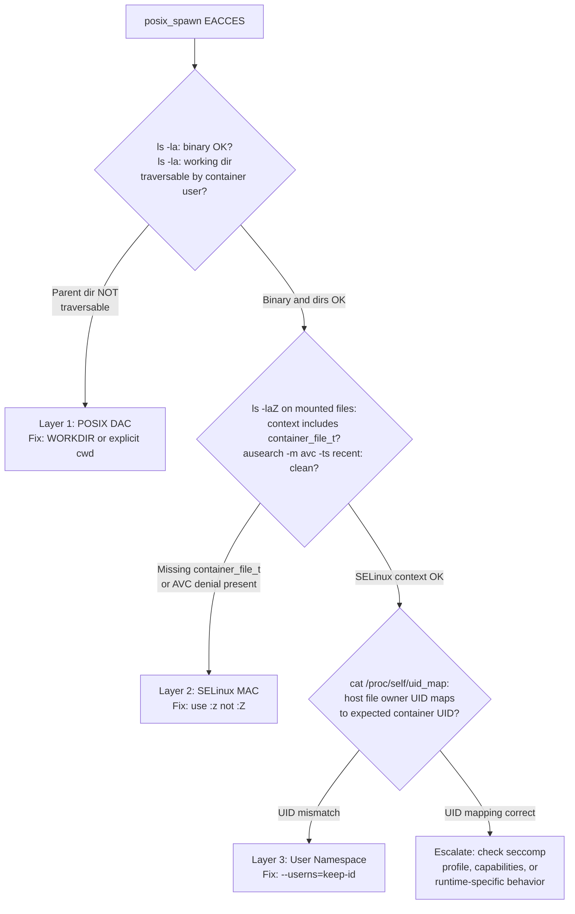

The error is unambiguous. Or so it seems.

```
EACCES: permission denied, posix_spawn '/bin/echo'
    path: "/bin/echo",
 syscall: "posix_spawn",
   errno: -13,
    code: "EACCES"
```

The binary is `/bin/echo`. It's world-executable. The container user has every right to run it. And yet `posix_spawn` refuses. If you've stared at this inside a rootless container and thought "but the permissions are fine" — you were right. For one of the three permission systems. The other two hadn't been checked yet.

Inside a rootless  container on an -enforcing host, spawning a child process passes through three independent gatekeepers:  (file ownership and mode bits), SELinux MAC (type labels and MCS categories), and Linux  UID mapping. Each one can fail. Each failure produces `EACCES`. And none of them tell you which layer broke.

## TL;DR

`posix_spawn EACCES` inside a rootless container doesn't mean the binary is unexecutable. Check the working directory traversal permissions (POSIX DAC), the SELinux volume labels (`:Z` vs `:z`), and the UID mapping (`/proc/self/uid_map`). The three layers are independent; only one is probably broken, but the error message points at none of them.

---

## Why Three Systems Instead of One

Linux did not design these permission systems to work together. They evolved separately, for different purposes, and they interact only at runtime — with no coordination and no shared error reporting.

POSIX DAC is the oldest layer: file ownership bits and the nine-permission rwxrwxrwx model. Every file has an owner, a group, and three permission sets. The kernel checks them in order. This layer has no concept of containers; it sees UIDs and GIDs, period.

SELinux is the MAC layer, added to the kernel by the NSA in 2003 and now maintained by Red Hat. It enforces policy regardless of what DAC says. A root process with full DAC permissions can still be blocked by SELinux if the policy doesn't allow the operation. In a container context, SELinux applies type labels to files and processes. Mounted volumes inherit the host's SELinux context unless you explicitly request relabeling — and how you request it matters.

User namespaces are the youngest layer, stabilized in Linux 3.8. They allow a process to have a different UID inside a namespace than on the host. Rootless containers depend on them entirely: the container's "root" is actually your unprivileged host user, and every other UID in the container maps to a range of subordinate UIDs from `/etc/subuid`. When you mount a file into the container, the kernel translates between the namespace's UIDs and the host's UIDs on every permission check.

These three systems each enforce independently. The kernel checks them in sequence, but if any one blocks the operation, you get back a single `errno`. And `EACCES` — permission denied — is what all three return when they say no.

## Layer 1: POSIX DAC and the Working Directory Trap

The first thing to understand about `posix_spawn EACCES` is that it doesn't mean `execve` failed. `posix_spawn` is not a single syscall; it's a sequence: set up file descriptor actions, change the working directory, adjust resource limits, then call `execve`. If any step before `execve` fails, the error wraps the entire spawn and reports the binary path as the failing resource — even if the binary was never touched.

Bun's spawn implementation makes this concrete. When you call `Bun.spawn(["some-command"])` without a `cwd` option, Bun sets the child's working directory to `jsc_vm.transpiler.fs.top_level_dir` — the process's working directory at startup. This is set via `posix_spawn_file_actions_addchdir_np`, which executes `chdir()` in the child before `execve`. See  for the exact call site.

The `oven/bun:slim` image sets `WORKDIR /home/bun/app`. The parent directory `/home/bun` is owned by the `bun` user (uid 1000) with mode **700**. If you run the container as a different user — say `runner` at uid 1001, which you added yourself — that user cannot traverse `/home/bun`. The `chdir("/home/bun/app")` call fails with `EACCES`. Bun then reports this as `posix_spawn EACCES` on whatever binary you tried to run.

What makes this diagnosis-defeating is that the binary works fine from a shell:

```bash
# Direct exec — no chdir involved. Works.
$ podman exec --user runner container /bin/echo test
test

# Bun.spawn — implicit chdir to /home/bun/app. Fails.
$ podman exec --user runner container bun -e "Bun.spawn(['/bin/echo','test'])"
EACCES: permission denied, posix_spawn '/bin/echo'

# Explicit cwd bypasses the problem. Works.
$ podman exec --user runner container bun -e "Bun.spawn(['/bin/echo','test'],{cwd:'/tmp'})"
test
```

The binary is fine. Bun's implicit `chdir()` is the culprit. Even `/usr/local/bin/bun` — the exact binary currently running the HTTP server — fails when you try to spawn a child, because the server itself started before any spawn-time `chdir()` is attempted, but the child process must attempt it fresh.

This is a documented class of issue with the `oven/bun:slim` image. The WORKDIR is set by root during image build, and the `bun` user (let alone any user you add) doesn't always have traverse permission to the parent. The fix: add `WORKDIR /home/runner` after `USER runner` in your Dockerfile, or always pass an explicit `cwd` to `Bun.spawn()`.

The pattern applies beyond Bun. Any runtime that sets a default working directory on spawn — rather than inheriting the parent process's current directory — can produce this failure. The `WORKDIR` stanza in a base image often reflects the image author's expected user, not yours.

## Layer 2: SELinux and Volume Labels That Destroy Ownership

After fixing the working directory, volume mounts present the next problem. Files mounted from the host into a rootless container fail with `Permission denied` — not because the Unix permissions are wrong, but because the SELinux context is wrong.

Podman provides two volume label options for this: `:z` (lowercase) and `:Z` (uppercase). They sound like spelling variants. They behave fundamentally differently. The  covers both, but the interaction with user namespaces is easy to miss.

`:z` applies the shared label `container_file_t:s0` to the mounted content. Any container on the host can read files with this label. The files remain owned by whoever owned them on the host.

`:Z` applies an *exclusive* label: `container_file_t:s0:cXXX,cYYY`, where `cXXX,cYYY` is the unique MCS (Multi-Category Security) pair assigned to this specific container. Only this container's process can access files with that label. No other container can read them — including a second instance of the same image.

The destructive part of `:Z` emerges in combination with rootless containers and user namespaces. When Podman relabels a volume with `:Z`, it calls `chown` on the files to match the container process's effective UID. In rootless mode, that effective UID is in the subordinate UID range allocated to the host user — something like uid **525288**. The host files, previously owned by uid 1000, are now owned by a uid that only exists inside the user namespace. The original container (which expected uid 1000 ownership) is also broken. The damage is permanent until you manually restore ownership:

```bash
sudo chown -R 1000:1000 /home/keep/.claude /home/keep/.claude.json
```

The table makes the difference explicit:

| Label | SELinux type | MCS category | Ownership effect |
|-------|-------------|--------------|-----------------|
| `:z` | `container_file_t` | Shared (`s0`) | No change |
| `:Z` | `container_file_t` | Exclusive (`s0:cXXX,cYYY`) | May shift ownership with userns |
| (none) | Host context (e.g. `user_home_t`) | Unchanged | No change; likely SELinux denial |

The correct option for bind-mounting host credential files into a rootless container is `:z`. Use `:Z` only when the mounted directory contains secrets that must be exclusively isolated to a single container, and when you're not using a user namespace that would shift ownership.

Quick confirmation: run `ls -laZ` on the mounted path inside the container. If the SELinux context doesn't include `container_file_t`, you'll get a denial. If the context does include it but the UID is wrong, you have a user namespace ownership mismatch — which is layer three.

## Layer 3: User Namespaces and the Identity Shift

Even with `:z` labels and correct Unix permissions on the host, files can appear owned by the wrong user inside the container. This happens because rootless Podman's default UID mapping doesn't preserve host UIDs.

Without `--userns=keep-id`, the default mapping for a host user at uid 1000 looks like this inside the container:

```
# /proc/self/uid_map
         0          1       1000    # container 0-999 → host 1-1000
      1000          0          1    # container 1000 → host 0
      1001       1001      64536    # container 1001+ → host 1001+
```

Host uid 1000 maps to container uid **999**, not 1000. A file owned by the host user (uid 1000) appears inside the container owned by uid 999 — a UID that doesn't exist in `/etc/passwd`. The `ls` output shows a bare number, and any read protected by user ownership fails silently.

`--userns=keep-id` changes the mapping so the current rootless user's UID is the same both inside and outside the namespace. Host uid 1000 → container uid 1000. Files mounted from the host user's home directory appear owned by the expected container user. The  covers the interaction between these two layers in detail.

This option pairs naturally with choosing a container user whose UID matches the host user's UID. The `oven/bun:slim` image includes a `bun` user at uid 1000. If your host user is also at uid 1000, they align naturally with `keep-id`. If you've added a custom user at a different UID, you'll need to adjust the mapping or create the container user with a matching UID.

In a systemd Quadlet `.container` file:

```ini
PodmanArgs=--userns=keep-id --stop-timeout=10
```

Reading `/proc/self/uid_map` from inside the container is the most direct verification. If the mapping doesn't show your host UID → same container UID, this layer is the problem.

## Diagnosing Which Layer Failed

The three layers are independent, but they have different diagnostic signatures. A methodical check resolves most cases in minutes.



Three concrete checks, one per layer:

**Layer 1 — POSIX DAC:** `ls -la` the binary AND every directory in the path, including the current working directory. The container user must be able to traverse each parent directory. Mode 700 on any parent blocks traversal for everyone except the owner.

**Layer 2 — SELinux MAC:** `ls -laZ` the mounted volume paths. Verify the SELinux context includes `container_file_t`. Run `ausearch -m avc -ts recent` on the host to catch any silent denials. SELinux denials don't always propagate as visible errors to the container process.

**Layer 3 — User namespace:** `cat /proc/self/uid_map` inside the container. Verify that the host UID of the mounted file's owner maps to the expected container UID. A mismatch of one (999 vs 1000) is easy to miss from `ls` output alone.

 is a fourth layer worth knowing, but it's the easiest to rule out: if the parent process is running at all, then `vfork` and `execve` are not blocked by the seccomp profile. A seccomp denial on spawn-related syscalls would prevent the server from starting entirely — not just block child process creation.

The deeper lesson is about the error message itself. `posix_spawn EACCES` reports the binary path because that's what the API surfaces to the caller. The actual failure could be anywhere in the spawn sequence — a directory traversal check, a working directory change, an SELinux label mismatch, or a UID translation that produces unexpected ownership. Knowing that three independent gatekeepers exist, and knowing what each one checks, is what makes the difference between a ten-minute diagnosis and an afternoon spent testing seccomp profiles that were never the problem.
