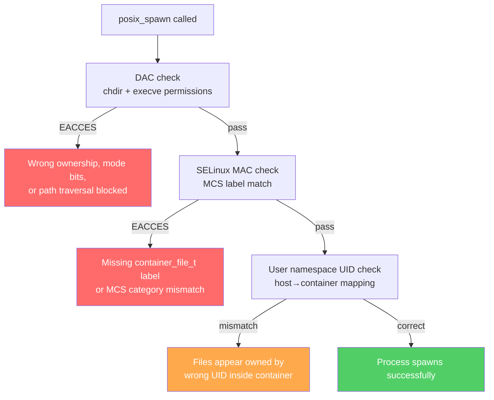

```
EACCES: permission denied, posix_spawn '/bin/echo'
    path: "/bin/echo",
 syscall: "posix_spawn",
   errno: -13,
    code: "EACCES"
```

The binary shown in that error is not the problem. `/bin/echo` is world-executable and readable by everyone. The problem is that `posix_spawn` is not a single operation — it's a sequence: set up file descriptors, change working directory, set resource limits, then exec. Any step can fail with `EACCES`, and the error message tells you only which binary you were targeting, not which step failed first.

Inside a rootless container, three independent permission systems can each produce this failure at different points in that sequence. Fix the wrong one and nothing changes. The error message stays the same throughout.

## Three Permission Systems

**POSIX Discretionary Access Control (DAC)** is the classic UNIX permission model: file ownership and mode bits. A process needs execute permission on a binary and traverse permission on every directory component of any path it accesses. DAC failures are the most intuitive, but they can appear in non-obvious places when a runtime's spawn implementation does work — like changing the working directory — before calling exec.

**SELinux Mandatory Access Control (MAC)** operates independently of DAC. Even if ownership and mode bits would permit an operation, SELinux can still deny it based on type enforcement and label matching. In container contexts, SELinux uses Multi-Category Security (MCS) labels to isolate containers from each other and from the host. Volume mounts require correct labels or SELinux will refuse access — and the denial shows up in audit logs, not in the error returned to the process.

**Linux user namespaces** make rootless containers possible by mapping UIDs inside the container to different UIDs on the host. A file owned by host UID 1000 might appear inside the container as UID 0, UID 999, or UID 1001 depending on the translation table in `/proc/self/uid_map`. When the mapping is wrong, files that should be accessible appear to belong to the wrong user, causing DAC failures even when the intent was correct.

All three systems can produce `EACCES`. And they can fail in sequence — fixing one reveals the next — while the reported error stays identical.



Here is a case where all three systems failed in sequence, each hidden behind the same error code.

## The Setup

Fedora 43, SELinux enforcing, rootless Podman managed by systemd Quadlet. A Bun HTTP server inside a container accepts POST requests and spawns a child process. The container user is `runner` (uid 1001), added via `useradd`. The host user `keep` (uid 1000) runs Podman. Credentials from the host are mounted into the container.

```dockerfile
FROM claude-runner  # oven/bun:slim + claude-code CLI

RUN useradd -m runner
COPY server.ts /app/server.ts
ENV HOME=/home/runner
USER runner
EXPOSE 3000
ENTRYPOINT ["bun", "run", "/app/server.ts"]
```

```ini
[Container]
Image=localhost/claude-runner-api:latest
Volume=/home/keep/.claude:/home/runner/.claude:Z
Volume=/home/keep/.claude.json:/home/runner/.claude.json:Z
Network=n8n.network
NoNewPrivileges=true
```

The server starts and serves requests as `runner`. The first spawn attempt fails:

```
EACCES: permission denied, posix_spawn '/bin/echo'
    path: "/bin/echo",
 syscall: "posix_spawn",
   errno: -13,
    code: "EACCES"
```

Every binary fails — `/bin/echo`, `/usr/local/bin/claude`, even `/usr/local/bin/bun` (the exact binary already running the server).

## Issue 1: The DAC Failure — Bun's Implicit chdir

### Ruling out the obvious suspects

Binary permissions are fine:

```bash
$ podman exec systemd-claude-runner-api ls -la /usr/local/bin/bun
-rwxr-xr-x. 1 root root 99651952 Apr  9 06:07 /usr/local/bin/bun
```

755 permissions, world-executable. Not the problem.

`NoNewPrivileges=true` was the next suspect. Removing it from the Quadlet and redeploying produced the same error.

Seccomp was eliminated by observation: the Bun server itself is running, which proves `execve`, `vfork`, and `clone` are allowed in the seccomp profile. If seccomp blocked `posix_spawn`, the server would never start.

SELinux was also ruled out. An SELinux denial appears in `ausearch -m avc`. There were no AVC denials. SELinux denials also have a distinct signature at the syscall level — this error was coming from somewhere else.

### The actual cause

Bun's spawn implementation always calls `chdir()` to the working directory in the child process before calling `execve()`. When no `cwd` option is passed to `Bun.spawn()`, Bun defaults to the calling process's current working directory.

The `oven/bun:slim` image sets `WORKDIR /home/bun/app`. The parent directory `/home/bun` has mode **700**, owned by `bun` (uid 1000). The `runner` user (uid 1001) cannot traverse `/home/bun`, so `chdir("/home/bun/app")` fails with `EACCES`. The binary is never reached.

This explains why `/usr/local/bin/bun` fails to spawn even though bun is already running — the server started with the same working directory (`/home/bun/app`), but the spawn path hits the `chdir` before exec, and `chdir` fails because `runner` cannot traverse the path.

### Evidence

```bash
# Direct exec works — no chdir involved:
$ podman run --rm --user 1001:1001 oven/bun:slim /bin/echo test
test

# Bun.spawn fails — implicit chdir to /home/bun/app:
$ podman run --rm --user 1001:1001 oven/bun:slim \
    bun -e "Bun.spawn(['/bin/echo','test'])"
EACCES: permission denied, posix_spawn '/bin/echo'

# Explicit cwd bypasses the chdir problem:
$ podman run --rm --user 1001:1001 oven/bun:slim \
    bun -e "Bun.spawn(['/bin/echo','test'],{cwd:'/tmp'})"
# succeeds

# Overriding WORKDIR at run time also fixes it:
$ podman run --rm --user 1001:1001 --workdir /tmp oven/bun:slim \
    bun -e "Bun.spawn(['/bin/echo','test'])"
# succeeds
```

The pattern is clear. Direct exec — `podman exec ... /bin/echo` — never changes the working directory, so it succeeds. `Bun.spawn()` inherits the process working directory and `chdir`s to it in the child. When that directory lives inside a path the container user cannot traverse, every spawn fails regardless of the binary.

### Fix

Add `WORKDIR /home/runner` to the Dockerfile after setting the user:

```dockerfile
USER runner
WORKDIR /home/runner
```

This ensures the container starts with a working directory the `runner` user owns and can traverse, so the implicit `chdir` in Bun's spawn path succeeds.

## Issue 2: The SELinux Failure — Volume Label Side Effects

After fixing the `WORKDIR`, the `runner` user still cannot access the mounted credential files:

```bash
$ podman exec --user runner systemd-claude-runner-api ls -la /home/runner/.claude/
ls: cannot open directory '/home/runner/.claude/': Permission denied
```

Checking the host:

```bash
$ sudo stat -c '%u:%g %n' /home/keep/.claude
525288:525288 /home/keep/.claude
```

The files are now owned by uid 525288 — a subuid in Podman's user namespace allocation range. They were originally owned by `keep:1000`. The `:Z` label changed them.

### What :Z actually does

The uppercase `:Z` volume option tells Podman to apply an exclusive MCS category to the volume. Each container instance receives a unique label such as `unconfined_u:object_r:container_file_t:s0:c124,c967`. Files in the volume are relabeled on the host to carry this label.

When `:Z` is used in a rootless Podman setup with user namespace mapping, the relabeling operation can also shift file ownership on the host. The original UID (1000) is replaced with the mapped subuid (525288 in this case). This is destructive — other processes on the host that expect files owned by the original UID, including other containers or tools that mount the same path, find them inaccessible.

### :Z vs :z

| Label | SELinux type | MCS category | Ownership behavior | Use when |
|-------|-------------|-------------|-------------------|----------|
| `:Z` | `container_file_t` | Unique per container | Can shift with user namespaces | Single container, no userns |
| `:z` | `container_file_t` | None (`s0`) | No ownership shift | Multiple containers or userns |
| (none) | Inherits host context | Inherits host | No change | Risk of SELinux denial |

### Fix

Switch from `:Z` to `:z`:

```ini
Volume=/home/keep/.claude:/home/runner/.claude:z
Volume=/home/keep/.claude.json:/home/runner/.claude.json:z
```

The lowercase `:z` applies the `container_file_t` type without an exclusive MCS category. Any container can access the volume from an SELinux standpoint, and file ownership on the host is not modified.

After switching, restore the ownership that `:Z` changed:

```bash
sudo chown -R 1000:1000 /home/keep/.claude /home/keep/.claude.json
```

## Issue 3: The User Namespace Failure — UID Mapping

With `:z` labels in place, the files are accessible but appear owned by the wrong user inside the container:

```bash
$ podman exec --user bun systemd-claude-runner-api ls -la /home/bun/.claude.json
-rw-------. 1 1001 1001 22448 Apr 10 20:16 /home/bun/.claude.json
```

The `bun` user is UID 1000 inside the container. The file shows as UID 1001. The container user cannot read a file that should belong to them.

### How the default UID mapping works

Rootless Podman creates a user namespace with a translation table visible at `/proc/self/uid_map` inside the container. Each row defines a range: `container_start host_start count`.

Without any `--userns` options, the default mapping for a host user at UID 1000 allocates the subuid range so that host UID 1000 does not map to container UID 1000. Instead, host UID 1000 falls in the first range and maps to a lower container UID — container UID 999, with the `bun` user at container UID 1000 mapping elsewhere. Files owned by `keep:1000` on the host appear inside the container as owned by UID 999, not UID 1000. Since `bun` is UID 1000, the file appears to belong to a different user.

### What --userns=keep-id does

`--userns=keep-id` creates a user namespace where the host user's UID maps to the same UID inside the container. A host user at UID 1000 appears as UID 1000 inside the container. Files owned by the host user appear to be owned by the corresponding container user at the same UID.

In this setup, the host user `keep:1000` and the container user `bun:1000` share the same UID. Files mounted from `/home/keep/` appear as `bun:1000` inside the container — which is exactly the `bun` user.

### Fix

Add `--userns=keep-id` to the Quadlet:

```ini
[Container]
Image=localhost/claude-runner-api:latest
Volume=/home/keep/.claude:/home/bun/.claude:z
Volume=/home/keep/.claude.json:/home/bun/.claude.json:z
PodmanArgs=--userns=keep-id --stop-timeout=10
Network=n8n.network
```

This requires aligning the container user to the host user's UID. Since `oven/bun:slim` already has a `bun` user at UID 1000 and the host `keep` user is also at UID 1000, they align naturally. The Dockerfile switches to `bun` instead of the previously added `runner`.

One additional adjustment: Bun's global package directory lives at `/root/.bun`, which `bun:1000` cannot access because root's home is mode 700. Copy it to a shared location:

```dockerfile
FROM claude-runner

RUN cp -a /root/.bun /opt/bun && \
    ln -sf /opt/bun/install/global/node_modules/@anthropic-ai/claude-code/cli.js \
           /usr/local/bin/claude

COPY server.ts /app/server.ts

ENV HOME=/home/bun
USER bun
WORKDIR /home/bun

EXPOSE 3000
ENTRYPOINT ["bun", "run", "/app/server.ts"]
```

## Diagnostic Checklist

When `posix_spawn` returns `EACCES` in a rootless container, work through the three layers in order. Each layer has a different diagnostic tool and a different fix.

**1. POSIX DAC — check file permissions and path traversal**

```bash
# The binary
ls -la /path/to/binary

# Every directory component of the runtime's working directory
ls -la /home/
ls -la /home/bun/        # look for mode 700 directories

# Inside the container — the process's current working directory
pwd
```

Also check the runtime's spawn documentation. Both Bun and Node.js default to the calling process's working directory when `cwd` is not specified. The working directory comes from the Dockerfile's `WORKDIR` instruction. If `WORKDIR` points inside a directory owned by a different user, spawn will fail for any non-root container user.

**2. SELinux MAC — check volume labels and audit logs**

```bash
# Check SELinux labels on mounted volumes
ls -laZ /path/to/volume

# Check for AVC denials (no output means no SELinux denials)
ausearch -m avc -ts recent

# Verify a file carries the container_file_t type
stat -c '%C' /path/to/file
```

If `:Z` was used and the files show the wrong ownership, switch to `:z` and restore the original UID with `chown`. Use `:Z` only for volumes accessed by exactly one container and only when not using user namespace remapping. Use `:z` everywhere else.

**3. User namespace — check UID translation**

```bash
# Inside the container — the mapping table
cat /proc/self/uid_map

# What UIDs the mounted files appear as inside the container
ls -la /path/to/mounted/file

# On the host — what UIDs the files actually have
stat -c '%u:%g %n' /path/to/host/file
```

If the host file UID must match the container user UID, use `--userns=keep-id`. Verify the container image has a user at the UID that matches the host user running Podman.

## Why the Error Message Misleads

`posix_spawn EACCES` is not a direct report of what failed. The POSIX spec defines `posix_spawn` as a function that performs several file-action steps before executing the binary. When any step fails, the error propagates up and gets reported against the binary name, not against the step that actually failed.

Runtime-specific spawn implementations make this worse. Bun's implicit `chdir` creates a failure mode that does not exist when you test with direct exec — `podman exec ... /bin/echo test` works because it skips the `chdir`. Only the spawn path fails.

The three permission systems are independent, and their fixes are unrelated. A `WORKDIR` change fixes a DAC path traversal issue. Switching `:Z` to `:z` fixes an SELinux ownership problem. `--userns=keep-id` fixes a UID mapping mismatch. Diagnosing at the wrong layer wastes time and produces no signal — the error looks identical regardless of which layer is failing.

Any service that spawns child processes inside rootless containers will hit some combination of these issues. The specific trigger varies by runtime, but the three-layer interaction is universal. Know which layer you are diagnosing before reaching for a fix.

---

## Sources

-  · Official documentation on SELinux volume label options
-  · How --userns=keep-id changes UID mapping behavior
-  · Red Hat guidance on choosing between :Z and :z
-  · Documented behavior of Bun's implicit chdir in spawn
-  · POSIX spawn specification including file actions
