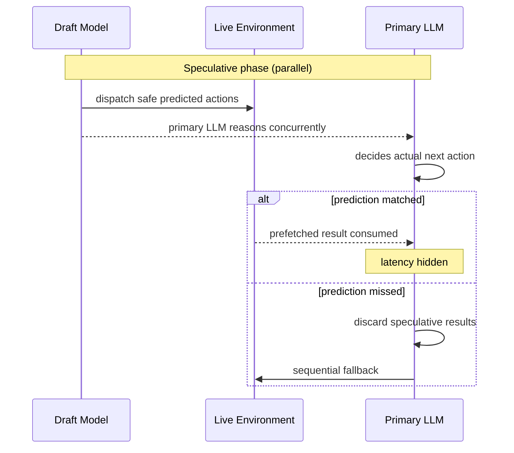

**TL;DR:**
- Sequential tool-call latency · not model speed or token cost · is the dominant wall-clock cost in multi-step 
-  · the CPU technique formalized in the 1980s · can be lifted directly to the agent tool-call level
- Columbia DAPLab's Speculative Actions framework (ICLR 2026 oral) achieves up to 55% next-action prediction accuracy and up to 20% end-to-end latency reduction with zero quality loss
- The safety key: only read-only, reversible actions are dispatched speculatively; writes always wait for confirmation
-  applied a simpler variant to their chatbot, cutting response time from ~6.5s to ~3.5s per interaction

---

## The Hidden Bottleneck

Here is a number that should bother every agent engineer: a 10-step agent with 2-second average tool latency accumulates 20 seconds of idle time, regardless of how fast your model is.

The standard agent loop · popularized by the ReAct framework (Yao et al., ICLR 2023) · interleaves reasoning traces with tool calls in strict sequence. The model emits a thought, decides an action, waits for the tool to respond, then emits the next thought. Sequential, ordered, correct, and brutally slow.

Data from ToolBench, a benchmark characterizing latency across 16,000 real-world APIs, shows that for agents running on fast LLM backends, tool-call latency accounts for over 60% of total wall-clock response time. The bottleneck is not the silicon running your language model; it is the sequential dependency structure of the loop itself.

The field's response has been to focus on accuracy: better prompting,  retrieval, smarter planning, more capable models. Latency is treated as a deployment concern · throw faster hardware at it, use a cheaper model, batch requests.

None of these touch the actual problem.

The bottleneck is algorithmic. And algorithms already solved it, forty years ago, in a completely different domain.

## How CPUs Solved This in the 1980s

When a modern CPU encounters a conditional branch, it cannot know the outcome without evaluating the condition. Stalling the pipeline until that happens is expensive: modern pipelines are 15-20 stages deep, and a stall means all that work goes idle.

The solution, formalized by James E. Smith in 1981 and industrialized through the 1990s, is : guess the branch outcome, continue executing down the predicted path, and roll back if the guess was wrong.

What makes this viable is a simple amortization argument. Branch prediction accuracy in practice runs 80-95%; the rollback cost for occasional misses is paid back many times over by the majority of correct guesses. Crucially, the output is identical to non-speculative execution · a misprediction triggers rollback to a consistent architectural state, not corruption of results.

The same insight was later lifted to LLM token generation. Leviathan et al. (Google, ICML 2023) and Chen et al. (DeepMind, 2023) showed independently that a small  can speculatively generate k tokens that a larger verifier validates in a single forward pass. Token acceptance rates of 70-90% translate to 2-3x inference speedups, and  is lossless by construction: the larger model rejects any draft token that diverges from its own distribution, then resamples correctly.

The abstraction hierarchy runs: CPU branches → LLM tokens → agent tool calls.

Each level applies the same pattern to a coarser unit of computation. Each requires the same enabling condition: predictions must be right often enough for the amortization to work.

## Lifting the Pattern to Agent Actions

's "Speculative Actions: A Lossless Framework for Faster Agentic Systems" · presented as an oral at ICLR 2026 · takes speculative decoding one level higher, from token sequences to tool-call sequences.

The mechanics are five steps:

1. **Draft prediction.** A small, fast draft model examines the current agent context and predicts the likely next k tool calls · their names, arguments, and expected sequencing · before the primary LLM has finished its reasoning step.
2. **Speculative dispatch.** Only safe predicted actions (read-only API calls, non-mutating queries, reversible prefetches) are executed immediately against live environments. Unsafe actions are held.
3. **Ground-truth execution.** The primary LLM completes its reasoning and produces the actual next action.
4. **Validation.** If the executor's action matches the draft prediction, the prefetched result is consumed and latency has been hidden. If not, speculative results are discarded.
5. **Fallback.** Execution proceeds sequentially · exactly as if speculative dispatch had never happened.

Here is a minimal pseudocode sketch of the dispatch loop:

```python
def speculative_dispatch(context, safe_classifier):
    draft_actions = draft_model.predict_next_k(context)

    futures = {
        action: executor.prefetch(action)
        for action in draft_actions
        if safe_classifier.is_safe(action)
    }

    ground_truth = primary_llm.step(context)

    if ground_truth in futures:
        return futures[ground_truth].result()  # latency hidden

    futures.cancel_all()
    return executor.run(ground_truth)  # sequential fallback
```

The losslessness guarantee is structural: incorrect speculations produce no observable side effects because only read-only calls were dispatched. The execution trace is indistinguishable from sequential execution in the worst case, and faster in the common case.

Here is the request flow:



Across gaming, e-commerce, and web-search benchmarks, the Ye et al. framework achieves up to 55% next-action prediction accuracy, translating to up to 20% end-to-end latency reduction. The gap between prediction accuracy and latency gain reflects two realities: even correct predictions carry some overhead from the parallel inference path, and tool-call time is only part of total agent runtime.

What makes 55% prediction accuracy achievable is a structural property of agent trajectories: they are **locally predictable**. In a web-shopping task, "search for product" is almost always followed by "click first result." In a data-retrieval pipeline, API call sequences are highly stereotyped. The draft model does not need to be globally intelligent; it needs to be locally correct often enough for amortization to work.

## The Safety Model That Makes It Practical

The most important design choice in Speculative Actions is not the draft model. It is the action classifier.

Speculative execution is only safe when mispredictions can be undone. For tool calls, the line is clear in principle:

**Safe to speculate:** search queries, database reads, API GETs, cache lookups, file reads, non-mutating LLM calls. All can be abandoned by ignoring the result.

**Unsafe to speculate:** POST requests, database writes, email sends, payment API calls, file writes. Any action with durable external side effects must wait for confirmation.

This mirrors hardware transactional memory · the mechanism CPUs use for optimistic concurrency control. Reads proceed speculatively within a transaction; writes commit atomically only after validation. Intel's TSX (Transactional Synchronization Extensions) operationalized exactly this asymmetry at the CPU level. Speculative Actions applies the same read/write boundary to tool calls.

The practical implication is more encouraging than it might sound. Real-world agent trajectories are often read-heavy early and write-heavy late. A research agent reads dozens of web pages before writing a summary. A planning agent queries multiple APIs before modifying any state. Speculative dispatch is most valuable exactly where these agents spend the most time.

 applied a simpler version of this pattern to their AI chatbot for incident response. Without changing their underlying model, they reduced per-interaction response time from roughly 6.5 seconds to 3.5 seconds · a 50% reduction · by speculatively launching tool calls before the primary LLM had confirmed it wanted them, and by generating responses optimistically before tools had returned results.

Their "write barrier" · preventing actual state changes until the LLM confirms an action is genuinely needed · is exactly the read/write asymmetry the Ye et al. framework formalizes. In voice interfaces, where response latency determines whether a conversation feels natural or stilted, saving 2-3 seconds per interaction is not a marginal improvement. It is the product.

## What This Means for Your Agent Stack

If you are running multi-step tool-calling agents in production, speculative dispatch is worth prototyping under the right conditions.

**Profile before you build.** If tool-call latency accounts for less than 40% of your agent's wall-clock time, the overhead of speculative dispatch will likely eat your gains. The pattern pays off most for agents where tool latency dominates · retrieval-heavy pipelines, research agents, multi-API planning workflows.

**The action classifier is the hard part.** For HTTP-semantics APIs, the read/write boundary is well-defined: GETs are safe, POSTs are not. The ambiguity surfaces with stateful tools · a "read" that increments a view counter, a webhook that fires on query. Domain-specific classifier rules will be necessary for these edge cases.

**The draft model does not need to be globally smart.** A lightweight model fine-tuned on your agent's historical trajectories can achieve competitive prediction accuracy for structured tasks. The 55% benchmark figure comes from general environments; task-specific fine-tuning should push this higher for stereotyped workflows where the early action sequence is predictable.

**Mind the cold-path cost.** On mispredictions, you pay for both the speculative dispatch and the correct sequential fallback. If your tool latency is very low · sub-100ms API calls, in-memory lookups · speculative overhead may outweigh savings. Measure actual wall-clock improvement against a baseline before committing.

**Honest limitations the research leaves open.** The Ye et al. framework does not fully specify draft model training objectives; this is an active research area. Prediction accuracy will degrade in dynamic environments where tool outputs are highly variable or user intent is ambiguous · the 55% figure represents structured benchmarks, not open-ended reasoning tasks. For human-in-the-loop approval flows, speculative dispatch during the approval wait is highly attractive but requires explicit UX design to handle the cancel path cleanly.

The 1990s out-of-order execution revolution in CPUs was not about faster transistors. It was about restructuring computation to extract parallelism from code that looked sequential. Instruction-level parallelism was always there; the hardware just needed to learn to see it.

The same insight applies to agent loops. Action-level parallelism is already there in the structure of your agent's trajectories. Speculative dispatch is the mechanism that exposes it.

Accuracy improvements are a legitimate research agenda. But latency is the axis that determines which agents are usable in production · and it is an algorithmic problem with algorithmic solutions available today.

---

## Sources

-  · Ye, Ahuja, Liargkovas, Lu, Kaffes, Peng — Columbia DAPLab (arXiv 2510.04371; ICLR 2026 oral)
-  · Leviathan, Kalman, Matias — Google (ICML 2023)
-  · Chen et al. — DeepMind (2023)
-  · Yao et al. (ICLR 2023)
-  · Qin et al. (2023)
-  · incident.io Engineering
