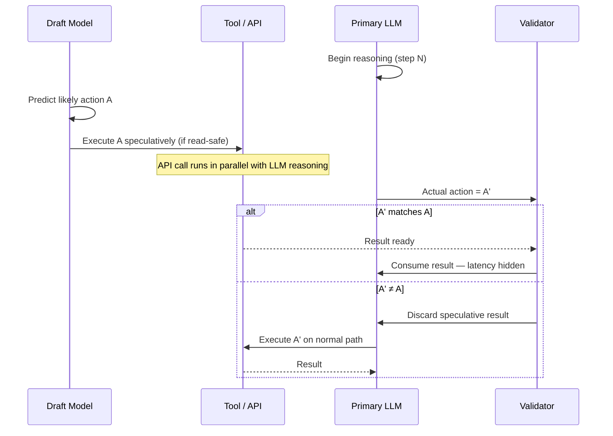

**TL;DR:**
- A 10-step agent with 2-second tool calls accumulates 20 seconds of pure idle wait, regardless of model speed
-  is the CPU technique that pre-runs future paths before knowing they're needed· the same pattern now applies to agent tool calls
- Columbia's DAPLab showed that a small draft model can predict the next agent action with up to 55% accuracy, which hides most of that wait behind actual computation
- Only read-only, reversible actions are dispatched speculatively· wrong predictions are discarded with zero side effects and zero quality loss

---

## The wait no one is measuring

Open any LLM agent paper from the last two years and you'll find careful benchmarks on task success rate, planning depth, and hallucination reduction. Latency benchmarks are conspicuously absent.

Here's the arithmetic that gets glossed over. The standard , Thought → Action → Observation repeated, executes tool calls sequentially. Each call blocks until the prior result arrives. [ToolBench](https://arxiv.org/abs/2307.16789), which characterized latency across 16,000 real-world APIs, found that for fast LLM backends, tool-call latency accounts for over 60% of total agent response time.

A 10-step agent with a 2-second average tool latency accumulates 20 seconds of pure idle time. Not computation. Not reasoning. Just waiting. Make your model twice as fast and those 20 seconds don't shrink· the bottleneck is structural, not silicon.

This is the central observation of the [Speculative Actions framework](https://arxiv.org/abs/2510.04371): the latency bottleneck is algorithmic. And algorithms already have a proven solution to this exact problem, one that has been running on your CPU for three decades.

## How CPUs cracked this in 1981

When a modern CPU encounters a conditional branch, it faces the same structural problem an agent does. It cannot evaluate the branch condition without executing prior computation· stalling the entire pipeline while it waits is catastrophic. Modern pipelines are 15–20 stages deep; a single stall wastes many cycles per branch.

The solution is : guess the branch outcome, pre-execute the predicted path, and roll back if the guess was wrong. This was formalized in James E. Smith's 1981 ISCA paper on  and industrialized through the 1990s as out-of-order processors became standard.

What makes the approach viable is the math. Branch prediction accuracy reaches 80–95% in practice, which means the cost of occasional rollbacks is easily amortized across the majority of correct predictions. Critically, the correctness guarantee is strong: a misprediction causes a full rollback to consistent architectural state, not silent corruption. Output is identical to non-speculative execution.

Google researchers Leviathan, Kalman, and Matias extended this pattern to LLM token generation in 2023 with [speculative decoding](https://arxiv.org/abs/2211.17192); Chen et al. at DeepMind arrived at the same result independently. A small draft model generates k candidate tokens· a large target model validates all of them in a single forward pass. Acceptance rates of 70–90% yield 2–3× decoding speedups with mathematically guaranteed losslessness. Token quality is provably unchanged.

 then asked the natural next question: if we can speculate at the token level, why not at the tool-call level?

## Lifting the pattern to agent actions

The [Speculative Actions paper](https://arxiv.org/abs/2510.04371), presented as an oral at ICLR 2026, extends the pattern one abstraction level higher, from token sequences to tool-call sequences.

The mechanism has five steps:

1. **Draft model predicts ahead.** A small, fast model observes the current agent context and predicts the likely next tool call (name, arguments, expected sequencing) before the primary LLM finishes its reasoning step.
2. **Safe actions are dispatched immediately.** Only read-only, reversible predicted actions are executed against live systems. Write operations are held until validation.
3. **Primary LLM produces the actual next action.** This step is happening anyway· no extra wall-clock time is introduced.
4. **Validation.** If the primary LLM's action matches the draft prediction, the pre-fetched result is consumed. The API call latency is hidden behind reasoning time.
5. **Mismatch means discard.** If the prediction was wrong, the speculative result is thrown away and execution continues on the normal path. No side effects were committed.



Across gaming, e-commerce, web-search, and operating-system benchmarks, the draft model achieved up to 55% next-action prediction accuracy. That means for roughly half of all agent steps, the tool-call latency is fully hidden behind the LLM's own reasoning time.

Agent trajectories turn out to be locally predictable in a way that is initially counterintuitive. In a web-shopping task ([WebArena](https://arxiv.org/abs/2307.13854)), "search for product" is almost always followed by "click first result." In data-retrieval pipelines, API call sequences are highly stereotyped within a task type. The draft model doesn't need global intelligence· it only needs to be right often enough for amortization to work. This is precisely the property that makes branch prediction viable in CPUs, applied one level up the abstraction hierarchy.

Here's the core logic in pseudocode:

```python
def speculative_agent_step(context, draft_model, primary_llm, classifier):
    # Draft model runs in parallel with LLM reasoning — no extra wall-clock time
    predicted_action = draft_model.predict_next(context)

    # Speculatively execute only if the action is safe to roll back
    prefetched = None
    if classifier.is_read_safe(predicted_action):
        prefetched = execute_async(predicted_action)

    # Primary LLM produces the ground-truth action (this was happening anyway)
    actual_action = primary_llm.reason_and_act(context)

    if actual_action == predicted_action and prefetched is not None:
        return prefetched.result()      # latency hidden
    else:
        return execute_sync(actual_action)  # normal path; no harm done
```

The critical design choice is the action classifier, not the draft model.

## The safety model that makes it deployable

Speculative execution is only safe when mispredictions can be undone. For CPUs, a rollback means restoring register state. For agent tool calls, a rollback means ignoring the pre-fetched result, which is only possible if the call produced no durable external side effect.

This mirrors : reads proceed optimistically within a transaction; writes are committed atomically only after validation. Intel's TSX (Transactional Synchronization Extensions) operationalized exactly this read/write asymmetry at the hardware level, and the same logic maps cleanly to HTTP-semantics APIs.

For agent tool calls, the boundary is pragmatic:

**Safe to speculate (no durable side effects):**
- HTTP GET requests and REST reads
- Database reads, search queries, cache lookups
- Non-mutating LLM calls (embeddings, classification)
- File reads and directory listings

**Unsafe to speculate (durable external effects):**
- HTTP POST, PUT, PATCH, DELETE
- Database writes and state mutations
- Email, SMS, notification sends
- Payment or billing API calls

This boundary has a favorable shape for many real-world workloads. A research agent queries ten sources before drafting a report· the write happens at the end. A data pipeline calls five retrieval APIs before updating a record· the mutation happens at the end. Speculative actions are strongest precisely where this front-loaded read pattern holds, which is common in planning, research, and retrieval agents.

The engineering team at  reportedly applied a simpler version of this pattern to voice-agent tool calling, saving several seconds per interaction. In voice interfaces, response latency directly maps to whether a conversation feels natural· those seconds are product quality, not an infrastructure detail. (Note: the specific engineering post describing this could not be independently located for direct citation; treat it as a directional reference.)

## What this means for your agent stack

The framework is implementable today without re-architecting your agent. Here's where the practical complexity actually lives.

**The action classifier is the real work.** For HTTP-semantics APIs, the read/write boundary is clear: GET is safe, POST is not. For stateful tools (a "read" that increments a view counter, a "search" that logs analytics), you'll need domain-specific rules. Build the classifier first; safety classification errors have real consequences.

**Train the draft model on your own trajectory data.** The 55% accuracy in the paper comes from task-specialized models, not generic small LLMs. Logs of your agent's historical action sequences are the training signal. The more stereotyped your task type, the stronger the draft model can become.

**The pattern is highest-value when:**
- Tool calls are slow (> 500ms average)
- Tasks involve five or more sequential actions
- The trajectory is structured enough for local prediction to work
- Human approval gates are in the loop· speculative reads during an approval wait are free latency savings that require no UX changes

**Expect draft model overhead on the cold path.** The draft model runs on every step, not just successful speculations. For agents with very fast tool calls (< 100ms), the inference cost of the draft model may outweigh the savings. Measure your specific workload before committing.

## The bigger picture

The dominant agenda in  research focuses on accuracy: better prompting, better  retrieval, better planning architectures like [Reflexion](https://arxiv.org/abs/2303.11366). Latency is treated as a deployment concern: throw faster GPUs at it, use a smaller model, cache more aggressively.

Speculative Actions reframes latency as a systems design problem with an algorithmic solution. The 1990s out-of-order execution revolution in CPUs wasn't about faster transistors· it was about restructuring computation to extract parallelism from code that looked strictly sequential. Agent loops that look strictly sequential at the Thought → Action → Observation level are not actually causally sequential at the tool-call level. The observation for step N often doesn't require finishing the reasoning for step N· it only requires knowing what action step N is likely to be. The draft model exploits precisely that gap.

If the next generation of production agents runs 10, 20, or 50 sequential tool calls, and trajectory data from [AgentBench](https://arxiv.org/abs/2308.03688) and WebArena suggests it will, then algorithmic latency optimization isn't an optimization pass. It's the performance axis that separates agents people use from agents people abandon.

## References

- Columbia DAPLab — [Speculative Actions: A Lossless Framework for Faster Agentic Systems](https://arxiv.org/abs/2510.04371) (ICLR 2026, oral)
- Leviathan, Kalman & Matias — [Fast Inference from Transformers via Speculative Decoding](https://arxiv.org/abs/2211.17192) (ICML 2023)
- Chen et al. (DeepMind) — [Accelerating LLM Decoding with Speculative Sampling](https://arxiv.org/abs/2302.01318)
- Yao et al. — [ReAct: Synergizing Reasoning and Acting in Language Models](https://arxiv.org/abs/2210.03629) (ICLR 2023)
- Shinn et al. — [Reflexion: Language Agents with Verbal Reinforcement Learning](https://arxiv.org/abs/2303.11366) (NeurIPS 2023)
- Zhou et al. — [WebArena: A Realistic Web Environment for Building Autonomous Agents](https://arxiv.org/abs/2307.13854) (ICLR 2024)
- Liu et al. — [AgentBench: Evaluating LLMs as Agents](https://arxiv.org/abs/2308.03688) (ICLR 2024)
- Qin et al. — [ToolBench: Facilitating LLMs to Master 16,000+ Real-world APIs](https://arxiv.org/abs/2307.16789)
