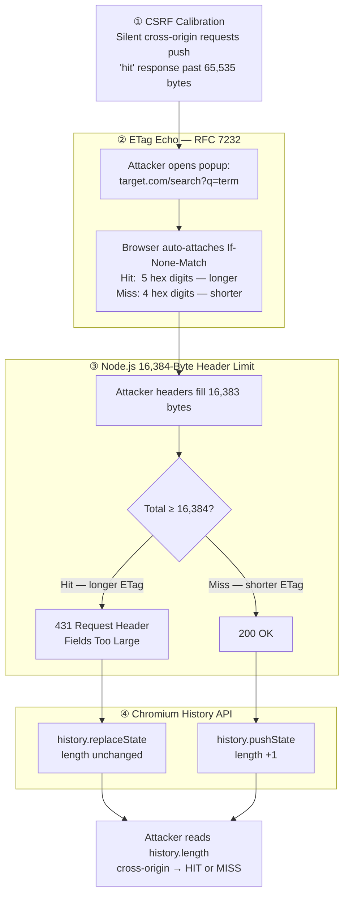

An attacker on `evil.com` can search through a victim's private inbox on `target.com`. They need no cross-site scripting vulnerability, no CORS misconfiguration, no injected code anywhere near the target server. Their only information channel, the only signal they need to determine which emails contain a target keyword, is a single byte difference in the length of an HTTP caching header that the victim's browser attaches automatically.

The technique, documented by security researcher arkark in  and recognised by the research community as one of , chains four independent browser and server behaviours into a fully functional cross-site binary search oracle. Each of the four components behaves exactly as specified. No single team (browser engine developers, HTTP runtime maintainers, caching-spec authors) can see the full composed attack surface on their own.

That is what makes this worth understanding beyond the mechanics. The lesson is not "patch your ETags," though you should. The lesson is that the byte count of every response your application generates is now part of your threat model.

---

## TL;DR

- **The signal**: Node.js weak ETags encode response byte length in hex. When a response crosses from 65,535 to 65,536 bytes (`0xffff` → `0x10000`), the ETag string grows by exactly one byte, a digit-boundary crossing.
- **The echo**: RFC 7232 requires browsers to include the stored ETag in an `If-None-Match` header on the next conditional GET. This is automatic· the length difference travels inside the victim's own request.
- **The trigger**: Node.js's hard 16,384-byte request header limit turns that 1-byte difference into a binary server response: `200 OK` versus `431 Request Header Fields Too Large`.
- **The read**: Chromium uses `history.replaceState` for 4xx navigations instead of `history.pushState`. An opener window can read `history.length` cross-origin, with no same-origin-policy obstacle, distinguishing 200 from 431 cleanly.
- **No single mitigation closes it**: `Cross-Origin-Opener-Policy: same-origin` closes the history oracle but not the 431 signal. Disabling ETags at the origin doesn't help if a CDN re-adds them upstream. Effective defence requires layered action across all four quirks.

---

## XS-Leaks: reading without touching

Classic cross-site attacks fall into two categories: attacks that *mutate* state (CSRF forces the victim to perform an action) and attacks that *read* state directly (XSS executes code on the victim's page).  (cross-site leaks) are a third category. They *infer* state by observing side effects visible from the attacker's own origin, without requiring any vulnerability on the target.

The side effects these techniques exploit include timing (did this request take longer, suggesting a cache hit?), cache state (is a specific resource already cached for this user?), error signals (did the server return a 4xx?), and size (did the response body grow?). Because these side effects emerge from the browser's own compliant behaviour, they cross origin boundaries without triggering any security check.

Two concepts frame the attack class. An **oracle** is any mechanism that reveals a binary yes/no answer about the victim's authenticated state on a third-party site. A **binary search** over a vocabulary of query terms, where each query costs one oracle call, is enough to determine whether private data contains any given string. Iterate that search across the characters of a target phrase, and a single binary oracle becomes a full  primitive.

The ETag oracle described below is a size oracle: it reveals whether a victim's authenticated search response is above or below a specific byte-count threshold. With a calibration step (described under Quirk 1), above the threshold means "hit" and below means "miss." That 1-bit signal is enough.

---

## The ETag as an inadvertent ruler

An ETag is an opaque identifier that an HTTP server assigns to a specific version of a resource, defined by . The spec defines two forms: *strong* ETags (byte-for-byte identity) and *weak* ETags (semantic equivalence, prefixed `W/`). RFC 7232 treats ETag values as opaque to clients· their internal format is the server's own business.

Node.js-based frameworks (Express, Fastify, Koa) converged on a practical weak ETag strategy: encode the response body's byte length in hexadecimal, concatenated with a timestamp:

```http
ETag: W/"1fff-18a7b4d3e00"
         ^^^^
         response byte-length in hex (0x1fff = 8,191 bytes)
```

This is legal under RFC 7232. It changes whenever the body changes without requiring a full hash computation. Its security implication went unnoticed for years.

The crack is arithmetic. Hex digit boundaries are unevenly spaced in decimal terms:

| Decimal range | Hex range | Digits | ETag string length |
|---|---|---|---|
| 0 – 4,095 | `0x000`–`0xFFF` | 3 | baseline |
| 4,096 – 65,535 | `0x1000`–`0xFFFF` | 4 | +1 character |
| 65,536 – 1,048,575 | `0x10000`–`0xFFFFF` | 5 | +1 character |

When a response body crosses from 65,535 bytes to 65,536 bytes, the hex encoding grows by one digit, and the ETag string grows by exactly one byte. An attacker who arranges for a search "hit" response to sit just above that `0xffff`→`0x10000` boundary, and a "miss" to fall just below it, has a ruler that distinguishes the two outcomes by a single character. The next question is how to read that ruler from a different origin.

---

## The four-quirk chain

Exploiting that 1-byte signal cross-origin requires three more independently correct system behaviours, each maintained by a different team, none designed with the others in mind.

### Quirk 1: CSRF as a calibration tool

To push the "hit" search response past the hex-digit boundary, the attacker must control how much content the target application has indexed for the victim. Cross-Site Request Forgery provides that lever.

Browsers automatically include session cookies on cross-origin requests (subject to `SameSite` policy). An attacker page can silently cause the victim to create content in the target application (new messages, new notes, new records) using only a hidden `<form>` submission or an `` tag with a crafted `src`. No XSS required. The attacker repeats: add content, run a preliminary oracle query, check the returned ETag digit count. Once the "hit" response crosses `0xffff` → `0x10000`, calibration is complete. The `SameSite=Strict` cookie attribute breaks this calibration step, which is why it belongs in the mitigation checklist even though it does not close the size oracle itself.

### Quirk 2: The browser echoes the ETag

Once the target endpoint has sent an ETag,  *requires* that the browser include it verbatim in an `If-None-Match` header on any subsequent conditional GET to the same endpoint:

```http
GET /search?q=secret_term HTTP/1.1
Host: target.com
If-None-Match: W/"10000-18a7b4d3e00"
               ^^^^^^^^^^^^^^^^^^^^^^^
               the ETag from the prior response, exactly as received
```

This is automatic. The browser's caching layer handles it entirely; no JavaScript on the target page participates. The implication: the length of the `If-None-Match` value is determined by the length of the previously received ETag. A "hit" ETag (5 hex digits, `0x10000`) produces a header value 1 byte longer than a "miss" ETag (4 hex digits, `0xffff`).

The attacker cannot read the ETag directly· same-origin policy blocks cross-origin response header access. But the ETag's length now rides inside the victim's *request* headers on the next visit, where the next quirk takes over.

### Quirk 3: Node.js has a hard header budget

 a default maximum incoming request header size of exactly **16,384 bytes**. Any request whose combined headers exceed this limit is rejected with `431 Request Header Fields Too Large` (RFC 6585). This limit applies to the total size of all request headers combined, including `If-None-Match`.

The attacker crafts the headers of the attack request to fill exactly 16,383 bytes of the budget, one byte short of the limit, using padding in legitimate-looking header fields. Now:

- "Miss" ETag (`0xffff`, shorter) → total = 16,383 + shorter = still under 16,384 → **200 OK**
- "Hit" ETag (`0x10000`, longer) → total = 16,383 + longer = exactly 16,384 → **431**

The 1-byte ETag delta has been amplified into a binary server-response distinction. Raising `maxHeaderSize` delays the attack (the attacker adjusts the padding arithmetic) but does not eliminate it.

### Quirk 4: Chromium reveals 4xx navigations via history

When a page navigation results in a 4xx response, Chromium calls `history.replaceState` rather than `history.pushState` for the navigation entry. This means the session history length (`history.length`) either increments on a 2xx response or stays the same on a 4xx response.

`history.length` is one of the few properties of a cross-origin window not blocked by the same-origin policy in the absence of `Cross-Origin-Opener-Policy`. The attacker, who opened the target endpoint in a popup from their own page, reads `window.openedWindow.history.length` after the navigation completes and detects whether the server returned 200 or 431, a clean binary signal with no CSP or CORS obstacle.

### The complete attack flow



Repeat the oracle query for each candidate term across a vocabulary. The attacker now has a fully functional cross-site search engine into the victim's private data.

---

## Mitigations: why no single fix is enough

The attack's four-layer composition means no single mitigation closes all exposure simultaneously. That is the structural problem.

| Mitigation | Quirk addressed | Residual exposure |
|---|---|---|
| `Cross-Origin-Opener-Policy: same-origin` | Quirk 4 (history oracle) | 431 remains observable via service workers |
| Opaque ETags (hash-based, not size-derived) | Quirks 1+2 (size encoding) | Eliminates the root information leak |
| Disable ETags on dynamic endpoints | Quirks 1+2 | CDN may re-add ETags upstream |
| `SameSite=Strict` cookies | Quirk 1 (CSRF calibration) | Does not close size oracle if calibration is available another way |
| Raise Node.js `maxHeaderSize` | Quirk 3 | Attacker adjusts padding arithmetic; attack persists |

Two specific nuances deserve attention.

**The CDN re-injection problem.** Disabling ETags at the origin server is necessary but insufficient if a CDN sits in front of the application. CDN layers, including major commercial providers, may generate their own ETags for cached responses. Depending on their ETag generation strategy, those values may re-introduce the size-encoding behaviour the origin removed. A complete defence requires auditing ETag headers in the CDN configuration, not just changing the origin server.

**The service worker residual.** `COOP: same-origin` closes the opener-window oracle (Quirk 4) but leaves the 431 status code intact. A service worker registered on the attacker's origin can observe response status codes for navigated requests through the Fetch API; this gives the attacker a potential alternative channel to detect the 431. This residual has been documented by the original researcher but has not yet been assembled into a complete alternative exploit chain.

### Recommended layered defence

1. **Switch to opaque ETags on all dynamic endpoints.** Use a hash of the response content (e.g., a truncated SHA-256 of the body) rather than a size-timestamp encoding. This is the root-cause fix: it decouples ETag length from response byte count entirely.
2. **Set `Cross-Origin-Opener-Policy: same-origin`** on all authenticated endpoints to close the `history.length` oracle ().
3. **Audit CDN configuration** to confirm ETags are not re-added or reformatted upstream of the origin.
4. **Set `SameSite=Strict` or `SameSite=Lax`** on session cookies to eliminate the CSRF-based calibration mechanism.
5. **Review `Vary` header usage**: other sources of response-size variation (compression, personalisation, pagination) may support alternative oracle constructions against differently structured endpoints.

---

## The broader pattern: byte count as attack surface

The ETag oracle is the sharpest documented instance of a broader research programme that treats response byte counts as cross-site side channels.

The generalisation is wider than ETags. `Content-Length` headers in HTTP/1.1 responses expose byte counts to timing measurements and size-gated amplification tricks. HTTP/2 frame sizes leak byte counts even when `Content-Length` is absent. `Vary` header differentiation creates response-size variation correlated with user state. Cache timing has long been used to infer the presence or absence of cached content; size is another dimension of the same class, catalogued across dozens of techniques in the .

The architectural insight from the ETag oracle is that the byte count of an authenticated endpoint's response is not a neutral property. It is correlated with application state· search results, personalised feeds, and filtered records are larger when they contain matching content than when they do not. That correlation is observable across origin boundaries through multiple independent channels, each maintained by a different organisation.

Threat modelling for authenticated web endpoints now requires an additional question: *does the size of this response vary in ways that encode private state?* If the answer is yes, and if the endpoint serves users whose sessions can be triggered cross-origin, the size variation is an attack surface.

No single specification team (HTTP spec editors, Node.js maintainers, Chromium developers, CDN vendors) can answer that question for the full composed system. It requires cross-layer reasoning across boundaries that individual teams rarely cross. The ETag oracle is proof that such reasoning is not academic. Working data exfiltration, built from four components each doing exactly what it was supposed to do. PortSwigger ranked it among the top ten web hacking techniques of 2025.

The byte count of every response is now part of the threat model.

---

## Sources

-  · arkark · XS-Spin Blog · December 2025
-  · PortSwigger Research
-  · XS-Leaks community (continuously updated)
-  · IETF
-  · MDN Web Docs
-  · MDN Web Docs
-  · Node.js Documentation
-  · MDN Web Docs
-  · OWASP
-  · MDN Web Docs
