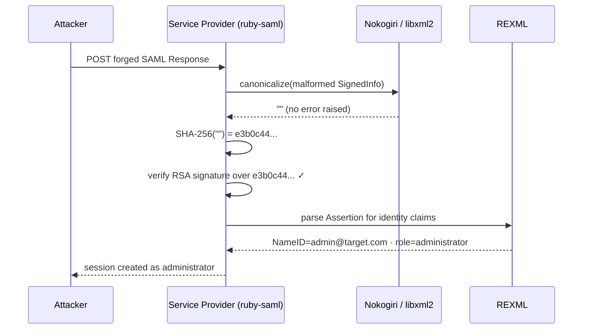

> **TL;DR** — libxml2's C14N function silently returns `""` on malformed XML. ruby-saml hashes that empty string without checking, producing a fixed, publicly known SHA-256 constant. One valid IdP-signed response is enough to forge a reusable signature that passes verification against any account on any affected Service Provider. Fix: ruby-saml ≥ 1.18.0 (CVE-2025-66568 / CVE-2025-66567). Node.js stacks: xml-crypto ≥ 6.0.1 (CVE-2025-29775).

## Contents

- [The math that shouldn't matter](#the-math-that-shouldnt-matter)
- [How SAML builds a trust chain](#how-saml-builds-a-trust-chain)
- [The dual-parser design decision](#the-dual-parser-design-decision)
- [The void: when canonicalization returns nothing](#the-void-when-canonicalization-returns-nothing)
- [Four steps from observer to administrator](#four-steps-from-observer-to-administrator)
- [SAMLStorm and the broader class](#samlstorm-and-the-broader-class)
- [What to do now](#what-to-do-now)

---

## The math that shouldn't matter

Every SHA-256 implementation, on every machine, agrees on one thing:

```
SHA-256("") = e3b0c44298fc1c149afbf4c8996fb924
              27ae41e4649b934ca495991b7852b855
```

This value is published in test vectors. It appears in every cryptography textbook that covers SHA-256. It is not a secret, and there is no expectation that it ever could be.

None of that is a problem — ordinarily. The hash of empty input is only dangerous when a signature verification library can be tricked into computing and later accepting a signature over nothing. When that happens, this constant becomes a skeleton key: one RSA signature, permanently reusable, valid against any  running the affected library.

That is exactly what CVE-2025-66568 enabled in ruby-saml before version 1.18.0. It is why , presented under the title "The Fragile Lock," demonstrated a complete authentication bypass against GitLab EE 17.8.4; a full account takeover with no stolen credentials and no brute force.

---

## How SAML builds a trust chain

When your application receives a  assertion — "this is alice@corp.com, she has the admin role" — it validates the XML Digital Signature attached to that document. The  mandates three steps, in order:

1. **Canonicalize** the signed XML subtree using the algorithm declared in `<CanonicalizationMethod>`
2. **Hash** the canonical bytes, producing a `DigestValue`
3. **Verify** the RSA signature in `<SignatureValue>` against that digest, using the 's public key

Step one exists because XML has no single canonical serialization. Two parties can represent the same logical document with different whitespace, different namespace prefix ordering, or different attribute quoting — and arrive at different byte sequences.  normalizes this variance before hashing, ensuring both the issuer and verifier compute identical bytes from the same logical content.

The  was finalized in 2001. The security community absorbed it as solved infrastructure. You call the C14N function, it returns normalized bytes, you hash them; the problem is treated as plumbing. That trust — trusted, unverified — is where this attack lives.

---

## The dual-parser design decision

, the dominant Ruby library for SAML SSO integration, made a pragmatic architectural choice: use **Nokogiri** — a Ruby binding for libxml2, the fast C XML library — for canonicalization, and use **REXML** — Ruby's standard-library pure-Ruby XML parser — for reading the assertion's fields after validation.

The rationale is not unreasonable. REXML is slow on large XML documents; libxml2 is substantially faster. When you have a performance-critical step like C14N, you reach for the C library. After validation is complete, REXML is convenient for traversing the assertion's attribute tree. Both parsers were assumed to agree on document structure; they were, after all, processing the same bytes.

But "same bytes" does not mean "same parse tree." Two independent parsers can construct different logical trees from the same input · and if the input is crafted carefully, those trees can diverge in exactly the ways an attacker needs.

Nobody thought to ask: what happens if they disagree about which elements exist?

---

## The void: when canonicalization returns nothing

Fedotkin's research identified the specific failure mode: **when libxml2's C14N function encounters certain malformed XML structures in the `<ds:SignedInfo>` block, it returns an empty byte string rather than raising an error.** No exception. No non-zero return code. Silent success delivering `""`.

ruby-saml, trusting the canonicalization output without checking its length, proceeds to compute:

```
canonicalize(malformed SignedInfo) → ""
SHA-256("") = e3b0c44298fc1c149afbf4c8996fb92427ae41e4649b934ca495991b7852b855
```

The library then verifies the RSA signature in `<SignatureValue>` against this digest. An attacker who has previously obtained a valid RSA signature over SHA-256("") — obtainable from any prior SAML interaction that also triggers the empty-output path — passes this check. Every time. Against any target. Fedotkin named this class **void canonicalization**.

This behaviour is assigned  (the libxml2 empty-string flaw) and CVE-2025-66567 (the broader parser differential enabling it). Both carry a CVSS 9.3 Critical rating and affect all ruby-saml versions prior to 1.18.0.

The root of the specification gap is worth naming. The  defines what a conforming C14N implementation must produce for valid, well-formed input. It does not specify mandatory error-signaling behaviour for malformed or unexpected input. In 2001, the threat model for XML Digital Signatures did not contemplate applications that would run two independent parsers over the same document within a single verification pass. libxml2's choice to return `""` was consistent with the spec — and catastrophic in context.

---

## Four steps from observer to administrator

To understand why this is exploitable, you need to see the two parsers as an attacker does: they are a seam between *what gets signed* and *what gets read*.

A void canonicalization attack constructs a SAML response where the `<ds:SignedInfo>` block is malformed in a way that causes libxml2 to produce empty output, while a forged `<saml:Assertion>` is embedded in a position that REXML traverses and reads correctly, but that libxml2's C14N silently skips:

```xml
<samlp:Response ...>
  <ds:Signature>
    <ds:SignedInfo>
      <!-- Malformed structure: triggers libxml2 to return "" from C14N -->
      <ds:CanonicalizationMethod Algorithm="http://www.w3.org/TR/2001/REC-xml-c14n-20010315"/>
      <ds:Reference URI="#forged">...</ds:Reference>
    </ds:SignedInfo>
    <ds:SignatureValue>
      <!-- Precomputed RSA signature over SHA-256("") -->
    </ds:SignatureValue>
  </ds:Signature>

  <!-- Forged Assertion: namespace REXML reads, libxml2 C14N skips -->
  <saml:Assertion ID="forged">
    <saml:Subject>
      <saml:NameID>admin@target.com</saml:NameID>
    </saml:Subject>
    <saml:AttributeStatement>
      <saml:Attribute Name="role">
        <saml:AttributeValue>administrator</saml:AttributeValue>
      </saml:Attribute>
    </saml:AttributeStatement>
  </saml:Assertion>
</samlp:Response>
```

The verification path through ruby-saml:



The attacker does not break RSA. They do not steal the IdP's private key. They do not intercept a live session. They need exactly one thing: **a valid RSA signature over SHA-256("")**. That signature is reusable against every account on every Service Provider running the unpatched library; it is as close to a universal skeleton key as the authentication layer can produce.

---

## SAMLStorm and the broader class

Void canonicalization is not an isolated bug; it is an instance of a structural attack class.

In the Node.js ecosystem, **SAMLStorm** (CVE-2025-29775) exploited a different mechanism in xml-crypto: an attacker could inject XML comments inside a `<DigestValue>` element in a way that the canonicalization component ignored but the assertion-reading component preserved, causing the two components to construct different views of the signed scope. The mechanisms differ; the architecture is identical.

The generalizable pattern is : two parsers process the same byte sequence, produce different logical trees, and the application trusts them for different purposes. One tree handles the security decision — signature valid or not. A different tree extracts the claims the application acts on. An attacker who can control the divergence between those trees can make the security decision pass while the claim tree contains arbitrary content.

The W3C XMLDSig specification, written in 2001, did not contemplate this architecture. It specified what correct C14N implementations must produce for valid input. It could not specify how every future implementation would compose canonicalization with assertion reading — whether through a single parse tree or through two independent parsers separated by a performance optimization decision made years later.

This is worth sitting with. The spec solved the normalization problem cleanly. The vulnerability is not in the spec. It emerged from an architectural pattern the spec never modelled; an absence of a rule in a 2001 document became the attack surface in a 2025 CVE.

---

## What to do now

**Patch immediately.** ruby-saml 1.18.0 treats an empty string returned from canonicalization as a hard validation failure. The empty output is no longer silently accepted as input to the hash step. For Node.js stacks: xml-crypto ≥ 6.0.1 addresses CVE-2025-29775, with backports to 3.2.1 and 2.1.6.

> **Note:** If you are running ruby-saml < 1.17.0, you are also exposed to CVE-2025-25291 and CVE-2025-25292, earlier parser differential flaws in the same library. Update directly to 1.18.0.

**Audit any SAML library in your stack.** Ask two questions:

1. Does the library use a C library such as libxml2 for canonicalization and a separate parser for assertion reading?
2. Does it validate that the canonicalization output is non-empty before computing the digest?

If the answer to (1) is yes and (2) is no, treat the library as unpatched regardless of the version number.

**Test your validation path.** Burp Suite's SAML Raider extension can send a SAML response with a stripped or malformed `<ds:SignedInfo>` block. Submit it to your Service Provider and verify the application returns a hard authentication failure, not a session. If it accepts the malformed response, your stack is vulnerable. This test belongs in the security regression suite for any SSO-integrated service.

---

## The structural lesson

Standards solve the problems they were designed to solve. They do not solve the implementation failure modes that arise when those standards are embedded in architectures the spec authors never modelled.

XML canonicalization has been "solved" since 2001. The spec is precise, well-tested, and deployed across thousands of systems. None of that prevented CVE-2025-66568. The spec's silence on malformed-input error signalling became a vulnerability when libxml2 returned `""` instead of raising, and when SAML libraries optimized their pipelines by routing the same document through two independent parsers without asking whether those parsers could disagree.

There is a name for what happened in the verification path: a **vacuous proof**. The library proved the signature was valid over a canonical form that contained nothing · and therefore proved nothing about the document the application would read next. But the check returned `true`, and a session was created.

The correctable principle is narrow and specific: any transformation step in a security-critical pipeline that can silently return empty or minimal output must validate its output length before the downstream step acts on it. This is not paranoia. It is the same discipline you apply to input validation at system boundaries, applied one layer deeper, at the transformation layer.

The plumbing nobody audits is exactly where attackers look.

---

## References

- Fedotkin, Z. (2025, December). *The Fragile Lock: Novel Bypasses for SAML Authentication*. Black Hat EU 2025. [https://portswigger.net/research/the-fragile-lock](https://portswigger.net/research/the-fragile-lock)
- NVD. *CVE-2025-66568*. [https://nvd.nist.gov/vuln/detail/CVE-2025-66568](https://nvd.nist.gov/vuln/detail/CVE-2025-66568)
- NVD. *CVE-2025-66567*. [https://nvd.nist.gov/vuln/detail/CVE-2025-66567](https://nvd.nist.gov/vuln/detail/CVE-2025-66567)
- NVD. *CVE-2025-29775 (SAMLStorm)*. [https://nvd.nist.gov/vuln/detail/CVE-2025-29775](https://nvd.nist.gov/vuln/detail/CVE-2025-29775)
- W3C. (2001). *Canonical XML Version 1.0*. [https://www.w3.org/TR/xml-c14n/](https://www.w3.org/TR/xml-c14n/)
- W3C. (2008). *XML Signature Syntax and Processing (Second Edition)*. [https://www.w3.org/TR/xmldsig-core/](https://www.w3.org/TR/xmldsig-core/)
- SAML-Toolkits. *ruby-saml releases*. [https://github.com/SAML-Toolkits/ruby-saml/releases](https://github.com/SAML-Toolkits/ruby-saml/releases)
- node-saml. *xml-crypto security advisory*. [https://github.com/node-saml/xml-crypto](https://github.com/node-saml/xml-crypto)
