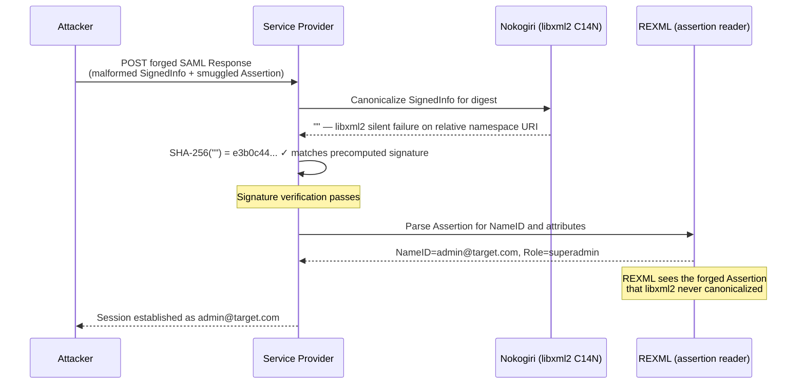

## TL;DR

CVE-2025-66568 (CVSS 9.1 Critical) describes a SAML authentication bypass in which libxml2's canonicalization function silently returns an empty byte string on certain malformed XML inputs. ruby-saml, trusting that output without checking its length, hashes it — producing a fixed, publicly known SHA-256 digest. An attacker who obtains one valid signature over that digest can forge arbitrary SAML assertions indefinitely, impersonating any user. **Patch to ruby-saml ≥ 1.18.0 immediately.** For Node.js stacks, ensure xml-crypto is patched for CVE-2025-29775 as well.

---

## Contents

- [How SAML Validates Trust](#how-saml-validates-trust)
- [The Dual-Parser Architecture](#the-dual-parser-architecture)
- [Void Canonicalization: When libxml2 Returns Nothing](#void-canonicalization-when-libxml2-returns-nothing)
- [The Attack Flow](#the-attack-flow)
- [A Broader Class: Parser Differential](#a-broader-class-parser-differential)
- [Mitigations](#mitigations)
- [The Structural Lesson](#the-structural-lesson)

---

## How SAML Validates Trust

When your application receives a  assertion claiming "this user is alice@corp.com with the admin role," it should reject that claim unless it is accompanied by a valid digital signature from a trusted Identity Provider. The verification model defined in the  has three mandatory steps:

1. **Canonicalize** the signed XML subtree using a defined algorithm (C14N)
2. **Hash** the canonical bytes — typically SHA-256
3. **Verify** the resulting digest against the RSA signature in `<ds:SignatureValue>`, using the IdP's public certificate

Step 1 exists for a subtle but necessary reason. XML has no single canonical serialization. The same logical document can be expressed with different whitespace, different namespace prefix ordering, or different attribute quoting — and two parties independently computing SHA-256 over their respective byte sequences would arrive at different hashes from the same intended document. The , finalized in 2001, solves this by defining a normalization procedure that maps all equivalent XML representations to identical byte sequences before anything is hashed.

This solved a real problem. It also became invisible infrastructure — reliable plumbing that stopped receiving the same scrutiny as the signature verification logic it supports.

That assumption is what makes void canonicalization possible.

---

## The Dual-Parser Architecture

ruby-saml — the dominant Ruby library for implementing IdP-initiated SSO — made a pragmatic performance decision: use **Nokogiri** for canonicalization and **REXML** for assertion parsing. Nokogiri is a Ruby binding for libxml2, a C library, and is substantially faster for the CPU-intensive C14N step. REXML is Ruby's standard-library XML parser — pure Ruby, slower, but already present in the runtime without an additional dependency.

The two parsers were expected to agree about document structure because they were processing identical bytes. The possibility that they could be made to see *different* documents from the same byte sequence was not a design concern.

But that is exactly the attack surface that was found.

Nokogiri and REXML build independent parse trees from the same input. When the document is well-formed, those trees match. When it contains constructs one parser rejects while the other silently tolerates — they diverge. The application uses Nokogiri's C14N output for the **security decision** (does the signature verify?) and REXML's parsed tree for the **data decision** (what claims does the assertion contain?). If those two parsers disagree, an attacker can forge content that REXML reads as gospel while Nokogiri verified something entirely different.

---

## Void Canonicalization: When libxml2 Returns Nothing

The specific trigger for CVE-2025-66568 is a relative namespace URI declaration in the `<ds:SignedInfo>` block — for example:

```xml
<ds:SignedInfo xmlns:ns="1">
  <!-- ... Reference elements ... -->
</ds:SignedInfo>
```

A relative namespace URI (a bare integer like `1`) is invalid under the XML Namespaces specification. REXML tolerates it and builds a parse tree that includes the element normally. libxml2's C14N implementation, however, encounters the relative URI during canonicalization, fails to resolve it, and returns an **empty byte string** — not an error code, not an exception, not a logged warning. Silent success with empty output.

ruby-saml, trusting that canonicalization had succeeded, proceeds to hash the result:

```
SHA-256("") = e3b0c44298fc1c149afbf4c8996fb924
              27ae41e4649b934ca495991b7852b855
```

This is not a secret. It is a universal constant — every conforming implementation of SHA-256 on every machine produces this exact 256-bit value for empty input. It is published in . You can reproduce it yourself in two lines:

```python
import hashlib
print(hashlib.sha256(b"").hexdigest())
# e3b0c44298fc1c149afbf4c8996fb92427ae41e4649b934ca495991b7852b855
```

The  defines what a conforming C14N implementation must produce for *valid* input. It does not mandate error-signaling behaviour for invalid input — a gap that made no difference in 2001, and became exploitable in 2025.

This is **CVE-2025-66568**. A companion issue, **CVE-2025-66567**, covers a related parser differential: Nokogiri and REXML construct sufficiently divergent parse trees from the same document that a Signature Wrapping attack becomes viable — the signed elements are relocated within the document such that REXML reads attacker-controlled claims while the signature over the original structure validates correctly. Both carry a CVSS score of 9.1 Critical.

### The precomputed skeleton key

An attacker who possesses a valid RSA signature over `SHA-256("")` — obtainable from any legitimately signed response whose SignedInfo followed the void path, or by crafting a session they control to produce one — holds a permanently reusable credential.

Because libxml2 will return empty for *any* forged document containing the relative-namespace trigger, the SHA-256 digest of the canonicalized SignedInfo will always be the same constant. That means **one signature unlocks every possible forged identity** for as long as the Service Provider runs an unpatched library.

---

## The Attack Flow

The four steps from crafting to session establishment:



In detail:

1. **Craft the `<ds:SignedInfo>` block** with a relative namespace URI (`xmlns:ns="1"`) so that libxml2 returns empty during canonicalization.
2. **Embed the forged `<saml:Assertion>`** — any NameID, any roles, any attributes — in a namespace or node position that REXML will traverse and parse correctly, but that libxml2's C14N silently skips.
3. **Attach the precomputed signature** over `SHA-256("")`. Because the empty-string digest is independent of Assertion content, this signature is universally valid for all forged documents.
4. **POST the response** to the Service Provider's SAML endpoint.

The SP's library canonicalizes → gets `""` → hashes to the known constant → signature check passes → REXML reads the forged claims → session is established with full attacker-chosen identity.

PortSwigger researcher Zakhar Fedotkin documented a complete end-to-end exploitation path in , presented at Black Hat Europe 2025. The demonstration included authentication bypass against GitLab EE 17.8.4 and a separate unnamed SaaS platform, including new account creation with attacker-chosen identity and full session access.

---

## A Broader Class: Parser Differential

Void canonicalization is not a unique quirk of libxml2 or ruby-saml. It is an instance of a general architectural pattern — **parser differential** — in which two components process the same byte sequence and construct different logical trees. The application trusts one component's view for the security decision and the other's for the data decision. When those views can be made to diverge, the security decision becomes meaningless.

In the Node.js ecosystem, **SAMLStorm** (, CVSS 9.3 Critical) exploited a structurally similar separation in . The specific mechanism was different: an attacker could insert XML comments inside the `<ds:DigestValue>` element that were silently ignored by the signature verifier but altered which bytes were actually hashed. The result was the same structural outcome — signature verification ran and passed, over content that did not match what the assertion reader would return to the application.

The xml-crypto advisory patched versions 2.1.6, 3.2.1, and 6.0.1. Node.js applications on any older version, processing untrusted IdP responses, should be treated as potentially compromised until patched and audited.

The pattern has now appeared across Ruby, Node.js, and PHP stacks, in multiple independent library codebases, affecting CVEs across multiple years. It is a category. The consequence of any SAML library design that separates the canonicalization/verification parse tree from the data-extraction parse tree — without a cryptographic guarantee that those trees are identical — is this class of vulnerability.

---

## Mitigations

### Patch immediately

| Library | Vulnerable | Patched |
|---------|-----------|---------|
|  | ≤ 1.12.4 | **≥ 1.18.0** |
|  | < 2.1.6 / 3.2.1 / 6.0.1 | **2.1.6, 3.2.1, or 6.0.1** |
|  | Audit your version | Apply C14N output-length fix |

The ruby-saml 1.18.0 patch adds a single invariant check: if the C14N output is an empty string, validation fails immediately rather than continuing to hash it. This closes the void canonicalization path regardless of what malformed input the attacker provides.

### Audit your library stack

For any SAML library in your stack, ask two questions before trusting its version number:

1. Does it use libxml2 or another C library for canonicalization, with a separate parser for assertion reading?
2. Does it explicitly validate that C14N output is non-empty before proceeding to the digest step?

If the answer to (1) is yes and (2) is no, treat the library as unpatched regardless of version claims.

### Test the validation path

Burp Suite's  extension can submit a SAML response with a stripped or malformed `<ds:SignedInfo>` block to your SP. A correctly patched application returns a hard authentication failure. An acceptance response — any positive outcome — means the empty-canonicalization path is still open. This test belongs in your SSO integration's security regression suite permanently.

---

## The Structural Lesson

Standards solve the problem as it was understood at the time of specification. The W3C Canonical XML spec, written in 2001, solved the normalization problem for valid XML. It did not contemplate a world where C14N would run inside a multi-parser pipeline, where silence rather than error would propagate through a security-critical computation, or where the failure mode of a standards-defined function would be the attack surface rather than its correctness.

The generalizable principle is precise: **any transformation step in a security-critical pipeline that can silently produce empty or minimal output is an invariant violation point.** Length validation on intermediate outputs is not defensive excess. It is the application of a basic engineering rule — verify preconditions — to a component the ecosystem had declared solved and stopped auditing.

In cryptographic engineering this failure has a name: a *vacuous proof*. The library proved that the signature was valid over a canonical form that contained nothing, and thereby proved nothing at all about the document REXML would present to the application. One line of Ruby — present in 1.18.0, absent in every version before it — would have prevented the entire class:

```ruby
raise ValidationError, "C14N produced empty output" if canonical_xml.empty?
```

The lesson generalizes past SAML. Any pipeline where component A transforms data that component B uses for security decisions, and where A can return empty or null without raising — is a pipeline that should have this check between A and B. Standards solve the specification problem. They do not solve the implementation's failure modes. That is still the library's job, and the reviewer's job, and yours.

---

## Sources

-  · Zakhar Fedotkin; primary research, Black Hat Europe 2025
-  · Void canonicalization in ruby-saml; CVSS 9.1 Critical
-  · Parser differential (Nokogiri/REXML) in ruby-saml; CVSS 9.1 Critical
-  · DigestValue comment injection in xml-crypto; CVSS 9.3 Critical
-  · Patch in release 1.18.0
-  · SAMLStorm patch; versions 2.1.6, 3.2.1, 6.0.1
-  · C14N specification; finalized 2001
-  · Three-step verification model
-  · SHA-256 specification; SHA-256("") value
-  · Testing tool for SAML validation paths
