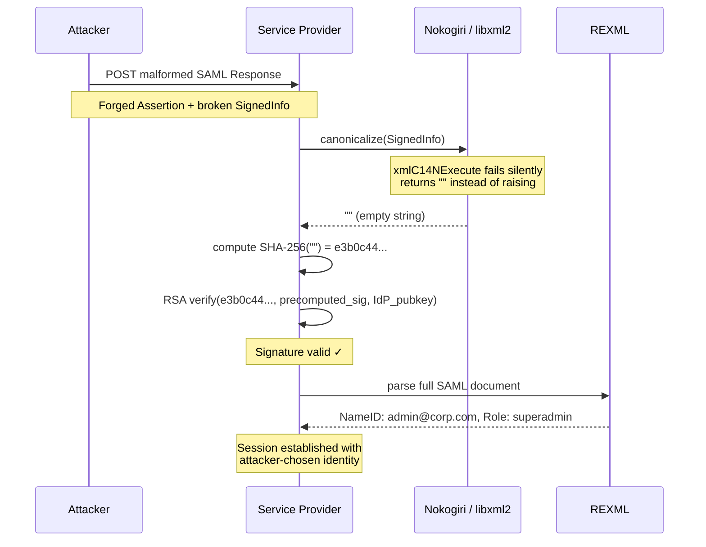

> **TL;DR:** SHA-256 of an empty string is a fixed, public constant: `e3b0c44298fc1c149afbf4c8996fb92427ae41e4649b934ca495991b7852b855`. When libxml2's canonicalization function silently returns `""` on malformed XML input, SAML libraries compute this digest instead of hashing the actual signed content. An attacker who once held a valid IdP-signed SAML response can precompute a reusable signature over that constant and impersonate any user on affected service providers. Patched in ruby-saml ≥ 1.18.0 (CVE-2025-66567, CVE-2025-66568) and xmlseclibs ≥ 3.1.4; the structurally parallel Node.js variant is CVE-2025-29775.

---

## The Plumbing Nobody Audits

When your application receives a  assertion ("this is alice@corp.com, she has the admin role"), it validates the  attached to that document before trusting any of those claims. The verification chain has three mandatory steps, defined in the W3C XMLDSig specification: **canonicalize** the signed XML subtree into a normalized byte sequence, **hash** those bytes (typically SHA-256), then **verify** the hash against the RSA signature in the `<ds:SignatureValue>` element using the 's public key.

Step one,  (C14N), exists because XML has many valid serializations of the same logical document. Whitespace can differ; namespace prefixes can be reordered; attribute quoting is flexible. Without normalization, two parties computing a hash of "the same document" might start from different byte sequences and disagree about validity.  solved this problem in 2001, defining precisely how a conforming implementation must serialize any valid XML input. By 2025, that specification is twenty-four years old. The security community treats it as solved infrastructure.

That "solved" status is exactly what attackers looked for.

The W3C spec's operative word is *valid*: it defines what a conforming implementation must produce for valid XML input. It says nothing about mandatory error-signaling behavior for malformed input. That silence gave implementors room to make quiet choices. One of those quiet choices turned out to be catastrophic.

---

## Two Parsers, One Document

The ruby-saml library, widely used to add IdP-initiated SSO to Ruby applications, made a pragmatic architectural choice: use Nokogiri (a Ruby binding for the libxml2 C library) for the C14N step, and use REXML (Ruby's pure-Ruby standard-library parser) to read the assertion's fields after validation.

The rationale is understandable. REXML is pure Ruby and historically slow on large XML documents; libxml2 is a C library substantially faster for canonicalization. The two parsers were never expected to disagree about document structure. They were processing the same bytes.

But they are two independent parse trees. And they can be made to see different documents.

This is the architectural pattern called : the component responsible for security decisions (signature verification, using Nokogiri/libxml2) and the component responsible for data extraction (reading NameID and attributes, using REXML) construct different logical trees from the same byte sequence. When those trees diverge, an attacker controls which tree the application acts on. It will not be the tree the signature validated.

The parser-differential pattern has been exploited before in XML contexts. Void canonicalization gave it a new lever: instead of merely injecting nodes that one parser sees and the other ignores, the attacker can make the security-path parser silently see *nothing at all*.

---

## The Void

Research presented at Black Hat Europe 2025 under the title  identified a lethal property of libxml2's C14N implementation: when processing certain malformed XML structures in the `<ds:SignedInfo>` block, libxml2's internal function `xmlC14NExecute` returns a negative integer, its signal for failure. Nokogiri's wrapper around that function did not check the return value. It returned an empty byte string to the Ruby caller instead.

ruby-saml, trusting the output of canonicalization without validating that it was non-empty, proceeded to compute:

```
SHA-256("") = e3b0c44298fc1c149afbf4c8996fb924
              27ae41e4649b934ca495991b7852b855
```

This is not an obscure value. The SHA-256 digest of empty input is specified in NIST FIPS 180-4 and reproduced in every SHA-256 test vector ever published. It is a universal constant: the same on every machine, in every language, every day.

The vulnerability was assigned **CVE-2025-66568** and  in the ruby-saml ecosystem, with a critical CVSS severity rating.

### Why the Silent Failure Is the Vulnerability

The C14N spec authors in 2001 wrote a specification for well-formed XML input. They did not mandate how implementations must signal failure for malformed input; the threat model of 2001 did not contemplate applications running two independent parsers on the same document within a single verification pass. The spec's silence on error signaling was not a mistake in the specification· it was an absence. And absences in security specifications are where attackers set up camp.

libxml2 made a plausible implementation choice: return empty rather than raise. In isolation, that choice is defensible. In a dual-parser context where the caller does not check the output length before hashing, it is catastrophic.

---

## From Constant to Skeleton Key

An attacker who has ever received a legitimate SAML response, even their own past authentication, holds an IdP-signed RSA signature over *some* payload. The critical insight: if the library will compute `SHA-256("")` regardless of what the forged document contains, the attacker needs only a valid RSA signature over `SHA-256("")`. That signature is permanently reusable. It works against every service provider running an affected library, for any claimed identity.

The attack follows four steps:

1. **Craft a malformed `<ds:SignedInfo>` block** that triggers libxml2's empty-output path. The SignedInfo is made invalid in a way that REXML will not notice: through a namespace trick, an unresolvable relative URI reference, or a structurally ambiguous element.

2. **Embed a forged `<saml:Assertion>`** containing any NameID, any attributes, any role, placed in a namespace or node position that REXML will traverse and read correctly but that libxml2's C14N will silently skip.

3. **Attach the precomputed signature** over `SHA-256("")`.

4. **POST the response to the Service Provider.** The SP calls canonicalize, receives `""`, hashes to the known constant, and RSA signature verification passes. REXML reads the forged assertion and returns whatever identity the attacker placed there. A session is established.

A simplified sketch of the `<ds:Reference>` carrying the predictable digest:

```xml
<ds:SignedInfo xmlns:ds="http://www.w3.org/2000/09/xmldsig#">
  <ds:CanonicalizationMethod
    Algorithm="http://www.w3.org/2001/10/xml-exc-c14n#"/>
  <ds:SignatureMethod
    Algorithm="http://www.w3.org/2001/04/xmldsig-more#rsa-sha256"/>
  <ds:Reference URI="#forged-assertion-id">
    <ds:DigestMethod Algorithm="http://www.w3.org/2001/04/xmlenc#sha256"/>
    <!-- Base64(SHA-256("")) — a well-known public constant -->
    <ds:DigestValue>47DEQpj8HBSa+/TImW+5JCeuQeRkm5NMpJWZG3hSuFU=</ds:DigestValue>
  </ds:Reference>
</ds:SignedInfo>
```

`47DEQpj8HBSa+/TImW+5JCeuQeRkm5NMpJWZG3hSuFU=` is the Base64 encoding of `SHA-256("")`. Any correct SHA-256 implementation produces it for empty input; it appears verbatim in the NIST test vectors.

 demonstrated a full end-to-end exploitation path on a vulnerable GitLab Enterprise Edition 17.8.4 instance: forged SAML response, new account created, complete authentication bypass.



---

## A Category, Not a One-Off Bug

The root cause of void canonicalization is not a misread specification or a typo. It is a structural consequence of the parser differential pattern: two parsers process the same XML bytes and construct different logical trees; the application trusts one tree for security decisions and a different tree for data extraction.

This class has appeared in parallel. In the Node.js ecosystem, **SAMLStorm** (CVE-2025-29775) exploited a structurally identical differential in the xml-crypto library: the C14N component and the assertion-reading component disagreed about which elements were present in the signed scope. Signatures verified correctly against a document that did not contain the forged claims the assertion reader saw.

The libraries that are not vulnerable to void canonicalization, XMLSec Library and Shibboleth xmlsectool, share a telling property: they use a single parser tree for both the C14N step and the assertion-reading step. The differential never has the opportunity to form. They are safer not because they handle libxml2's error return code correctly in isolation; they are safer because they never introduced the handoff between parsers in the first place.

This suggests a generalizable audit question for any SAML library in your stack: does the path from received XML to trusted claims pass through a single parse tree, or does it hand off between parsers at any point? Every handoff is a potential differential.

That question points to something broader about what "solved" means in cryptographic engineering. XML canonicalization solved the normalization problem at specification time. The spec did not contemplate failure modes in dual-parser contexts because those contexts did not exist in the threat model of 2001. Its silence on error signaling was not a mistake· it was an absence that found a home in implementations twenty years later.

In formal verification, this kind of failure has a name: a **vacuous proof**. The library proved that the RSA signature was valid over the canonical form of the signed content. That canonical form contained nothing. The proof was technically correct and completely meaningless· it verified a signature over an empty document and called it authentication.

### What to Patch and How to Test

The library-level fix is straightforward: treat an empty string returned from canonicalization as a fatal validation failure rather than a zero-length document to be hashed. A non-empty output invariant on the C14N step would have prevented this entire class.

- **ruby-saml ≥ 1.18.0**: patches CVE-2025-66567 and CVE-2025-66568. If you use omniauth-saml, verify it references a fixed version of ruby-saml.
- **xmlseclibs ≥ 3.1.4**: the widely used PHP XMLDSig library; this December 2025 release contains the equivalent C14N output-length check for PHP stacks using libxml2.
- **xml-crypto patched release**: for the Node.js SAMLStorm variant; see the CVE-2025-29775 advisory for the version floor appropriate to your dependency branch.

To actively verify your SP's validation path: Burp Suite's SAML Raider extension can send a SAML response with a stripped or malformed `<ds:SignedInfo>` block. A patched application must return a hard authentication failure. If the application accepts the request at all, even if it later emits an error page after establishing partial session state, the fix is incomplete. This test belongs in any security regression suite for SSO-integrated services.

The audit question to carry into every SAML library evaluation: does it validate that C14N output is non-empty before proceeding to the digest step? That single length check is the distance between a vacuous proof and an actual one.
