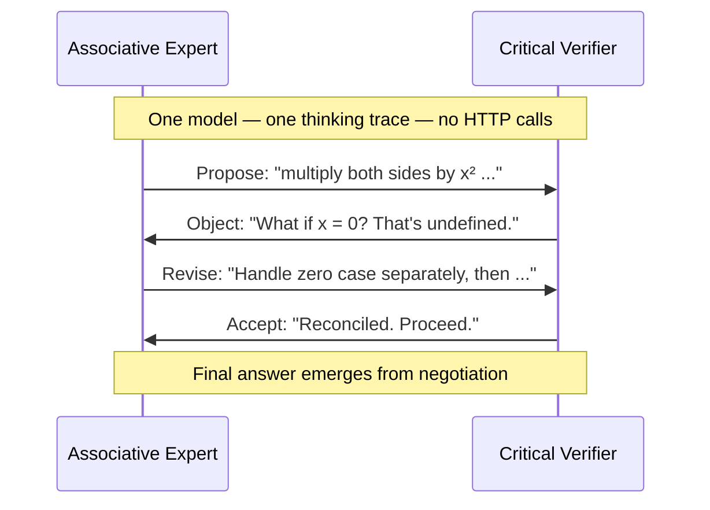

The multi-agent debate pipeline you are weighing whether to build may already exist inside your reasoning model. A January 2026 preprint from researchers at the University of Chicago and the Santa Fe Institute () examined the extended thinking traces of DeepSeek-R1 and QwQ-32B and found something nobody had trained into them: the models had spontaneously learned to debate themselves. Stable, distinct personas engaged in structured internal argument before settling on an answer. No dialogue training. No multi-agent scaffolding. Just  rewarded on correctness. This emerged.

> **TL;DR:**
> - A January 2026 preprint (arXiv:2601.10825, peer review unconfirmed) found that reasoning models trained via RL spontaneously develop stable internal personas: an "Associative Expert" (generative, proposing) and a "Critical Verifier" (skeptical, objecting), engaging in structured internal debate within a single model's thinking trace
> - This inverts the core assumption behind external multi-agent debate pipelines: diversity does not require multiple model instances
> - Three practical consequences: your multi-agent pipeline may duplicate internal reasoning at extra cost; the persona active at the moment of a tool call is a hidden source of production non-determinism; your safety classifier does not see what happens inside the thinking trace
> - No head-to-head benchmark comparing extended single-model thinking vs. external multi-agent pipelines exists yet· that is the experiment the field needs

## The society that appeared uninvited

Authors Junsol Kim, Shiyang Lai, Nino Scherrer, Blaise Agüera y Arcas, and James Evans examined the  traces of two reasoning models:  (DeepSeek-AI) and  (Qwen Team). Both were trained via reinforcement learning rewarded almost entirely on the correctness of final answers. Neither received any instruction to reason as a multi-agent system, adopt a dialogue format, or embody distinct personas.

And yet the traces showed exactly that. Within the extended thinking traces, the researchers identified recurring **socio-emotional personas**, stable archetypes that appeared consistently across problems and across both models. The two dominant types were:

- **The Associative Expert**: generative, pattern-matching, low neuroticism. Proposes pathways rapidly, comfortable with ambiguity, moves toward answers.
- **The Critical Verifier**: skeptical, interruptive, high neuroticism. Objects to proposals, forces re-evaluation, refuses to let the model commit prematurely.

These personas engage in structured internal debate (proposal, objection, reconciliation) before the model settles on an approach. The sequence resembles a negotiation more than a calculation. The diagram below shows this structure as it appears within a single model's thinking trace:

The controlled fine-tuning experiment sharpens the finding. When base models were fine-tuned with *conversational scaffolding* (framing the reasoning task as internal debate), accuracy improved faster than standard supervised fine-tuning on the same data. The model was already converging toward this structure on its own; the scaffolding merely accelerated what reinforcement learning had already begun to induce.

One note before proceeding: this is an arXiv preprint. The empirical results come from credible institutions and include a controlled experiment· peer review status is unconfirmed at time of writing. The finding is significant enough to engage with now; revisit it as review concludes.

## A field built on a wrong assumption

The architecture of contemporary AI agent systems rests on a foundational assumption: a single language model is a single perspective, and diversity requires multiple instances.

This assumption has a clean history.  prompting (Wei et al., ) demonstrated that models reason better when they externalize intermediate steps. The thinking trace became the critical surface. What lived inside that trace was assumed to be one voice thinking sequentially.

Tree of Thoughts (Yao et al., ) extended the linear trace into branching search. It made explicit what CoT left implicit: the reasoning space is large, and exploring multiple paths before committing improves performance on hard problems. The generate-evaluate loop (propose a thought, score it, branch or prune) demonstrated that diversity within the reasoning process matters. But Tree of Thoughts achieved this diversity externally: multiple model calls, a separate evaluation step, an outer loop managing the search. The assumption held. Diversity required orchestration.

External multi-agent debate (Du et al., ) applied the same logic at the model level: bring in multiple LLM instances, let them argue across rounds, and aggregate. The results were compelling: factuality and reasoning accuracy improved substantially when models could critique each other's responses. The assumption was now explicit: a single LLM is a single perspective; better answers require more instances.

This assumption, built carefully into the architecture of agent frameworks, turns out to be incomplete. The debate was already happening inside the context window. It just was not visible in the logs.

## What RL discovered that philosophy already knew

There is a pattern in how the AI field engineered self-critical reasoning before the Kim et al. finding.  (Bai et al., 2022) built an explicit self-critique loop: a model generates a response, critiques it against a set of authored principles, then revises. The mechanism is designed; it works because it was carefully constructed.

 (Lightman et al., 2023) externalized the critic role further: a separate process reward model, trained on human-labeled step correctness, scores intermediate reasoning steps for the generator. The assumption was that critic function requires specialization, a dedicated model trained specifically to catch errors.

The "Critical Verifier" persona in the Kim et al. traces is that specialist. Except it is not a separate model. It is a stable attractor that emerges in the extended context of a single model, without specialization training, driven solely by RL rewarded on correct final answers. What earlier work required careful external scaffolding to achieve, the reasoning model achieved internally as a side effect of learning to be right.

 (Shinn et al., 2023) extended the self-critique loop across time: agents reflect on failures across episodes, storing verbal feedback to improve future attempts. This externalizes the self-improvement loop across multiple interaction cycles. What the Kim et al. finding shows is that reasoning models are collapsing the same loop inside a single forward pass, spontaneously.

Marvin Minsky predicted something like this in *The Society of Mind* (1986): that intelligence would emerge not from a unified rational agent but from a society of smaller agents with distinct competencies, interacting and competing to produce behavior no single agent could produce alone. His agents were sub-symbolic processes, not language model personas (the analogy is suggestive rather than literal), but reinforcement learning rewarded on accuracy has independently arrived at something that rhymes closely with his central thesis.

Philosophy has known the broader principle for millennia. From Socratic dialogue through Hegelian dialectics, the evidence that structured adversarial exchange outperforms individual reasoning as a search strategy is extensive. It took gradient descent to rediscover it from scratch, inside a context window.

What we have been calling "a reasoning agent" is, at minimum, a compressed parliament.

## Three things practitioners need to rethink

The finding is operationally uncomfortable.

### Token cost versus architecture cost

The decision to build a multi-agent debate pipeline is usually framed as an architectural choice. The Kim et al. finding reframes it as a resource allocation question.

Before spinning up a five-agent debate pipeline, with its attendant orchestration complexity, API latency, and infrastructure cost, the question to ask is: does giving a single reasoning model a larger thinking token budget achieve comparable internal diversity at lower total cost? This has not been benchmarked head-to-head at scale; that experiment is the most valuable one the field could run right now. The finding suggests the answer may frequently be yes.

This is not an argument that external multi-agent orchestration is useless. Task decomposition, parallel execution, and specialization are legitimate architectural reasons to use it. The argument is narrower: if your reason for reaching for external multi-agent debate is to achieve *reasoning diversity*, you may be paying for something your reasoning model is already doing internally.

### Persona leakage into tool calls

This is the most practically urgent implication for anyone running a production agentic system.

If your  issues tool calls while mid-reasoning, as virtually all agentic frameworks require, the active internal persona at the moment of tool invocation influences the call. A tool call issued while the Associative Expert persona is dominant may be more expansive, less cautious, more likely to proceed under ambiguity. A tool call issued while the Critical Verifier is active may be more conservative, may add unexpected validation steps, may pause or refuse.

For the same task, the same model, the same prompt: the behavior of the tool call depends on where the model is in its internal reasoning cycle at the moment of invocation. This is a source of non-determinism that does not appear in standard logs. It is not captured by output-level evaluation. It is not addressed by prompt engineering at the system prompt level.

The Kim et al. fine-tuning result suggests an interesting possibility: if conversational scaffolding can nudge the model toward a specific internal structure, it may be possible to prompt for a particular persona to be active during tool-heavy phases of reasoning. Whether this improves reliability is a measurable empirical question. Nobody has measured it yet.

### Safety evaluation is incomplete

The  acknowledged early that internal reasoning traces present a novel safety evaluation challenge: the model may explore problematic reasoning paths internally before arriving at a safe final output. The Kim et al. finding sharpens this concern.

Internal personas may take positions within the thinking trace: endorsing specific plans, reasoning through specific tool invocations, evaluating options the final output never surfaces. If your safety classifier runs only on final outputs, those internal positions are invisible to it.

Those internal positions shape which tool calls get made. They shape what the model actually does in the world. A reasoning model whose internal Critical Verifier has evaluated and rejected a harmful approach will produce a safe output· the thinking trace still contains a record of that harmful proposal being considered and weighed before the safer alternatives were chosen. That trace is a safety surface. It is currently unmonitored in most production deployments.

## The questions we now need to answer

The Kim et al. paper raises more questions than it answers· that is what good empirical work does.

The benchmarking gap is the most urgent. Can a single reasoning model with sufficient thinking token budget match or exceed a three-to-five agent debate pipeline on standard reasoning benchmarks? What token budgets make them equivalent? This is a measurable experiment with real engineering implications. The field does not yet have a credible answer.

The persona observability question is practically valuable. Are there reliable signals (embedding patterns, linguistic surface features, activation probes) that indicate which internal persona is dominant at a given position in the thinking trace? If such signals exist and can be measured cheaply, they open a new dimension of agentic monitoring that current frameworks cannot provide.

The safety audit question is the most uncomfortable. Given that thinking traces contain decision-relevant content invisible to output-only classifiers, and that this content influences tool call behavior, what does adequate safety evaluation look like for reasoning models with tool use capabilities? The field's current answer is to evaluate outputs· that answer is incomplete. A better answer requires monitoring the trace. Monitoring the trace at scale is an unsolved engineering problem.

The deliberate steering question is the most speculative but also the most promising. If the internal debate structure responds to scaffolding, can it be steered deliberately? Can a system prompt bias the model toward Critical Verifier dominance during a high-stakes decision step, and Associative Expert dominance during a creative generation step? The fine-tuning result in the paper suggests this is a testable hypothesis, not a fanciful one.

What the field cannot continue to do is design agentic systems as if the model inside is a single coherent perspective. The empirical evidence is that it is not. The question is no longer whether to use multi-agent reasoning; it is already in use, whether you intended it or not. The question is how to observe, steer, and audit the multi-agent reasoning that lives inside every extended thinking trace.

## References

- Kim, J., Lai, S., Scherrer, N., Agüera y Arcas, B., & Evans, J. [Reasoning Models Generate Societies of Thought](https://arxiv.org/abs/2601.10825) (arXiv:2601.10825, 2026). *Preprint; peer review unconfirmed.*
- DeepSeek-AI. [DeepSeek-R1: Incentivizing Reasoning Capability in LLMs via Reinforcement Learning](https://arxiv.org/abs/2501.12948) (arXiv:2501.12948, 2025)
- Qwen Team. [QwQ-32B](https://qwenlm.github.io/blog/qwq-32b/) (2025)
- Du, Y., Li, S., Torralba, A., Tenenbaum, J. B., & Mordatch, I. [Improving Factuality and Reasoning in Language Models through Multiagent Debate](https://arxiv.org/abs/2305.14325) (arXiv:2305.14325, 2023)
- Yao, S., et al. [Tree of Thoughts: Deliberate Problem Solving with Large Language Models](https://arxiv.org/abs/2305.10601) (arXiv:2305.10601, 2023)
- Wei, J., et al. [Chain-of-Thought Prompting Elicits Reasoning in Large Language Models](https://arxiv.org/abs/2201.11903) (arXiv:2201.11903, 2022)
- Bai, Y., et al. [Constitutional AI: Harmlessness from AI Feedback](https://arxiv.org/abs/2212.08073) (arXiv:2212.08073, 2022)
- Lightman, H., et al. [Let's Verify Step by Step](https://arxiv.org/abs/2305.20050) (arXiv:2305.20050, 2023)
- Shinn, N., et al. [Reflexion: Language Agents with Verbal Reinforcement Learning](https://arxiv.org/abs/2303.11366) (arXiv:2303.11366, 2023)
- OpenAI. [OpenAI o1 System Card](https://openai.com/index/openai-o1-system-card/)
- Minsky, M. *The Society of Mind* (Simon & Schuster, 1986)
