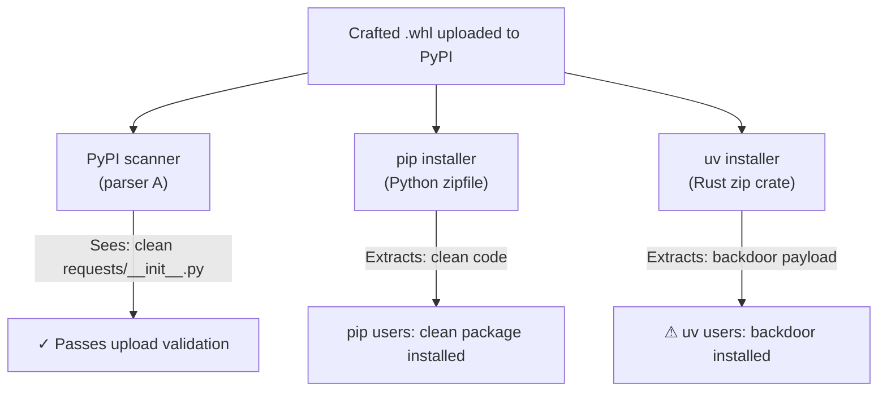

A Python package can be simultaneously clean and malicious. Same file, two parsers, two entirely different packages installed.

This is not obfuscation. There is no , no polymorphic shellcode, no exotic anti-analysis technique. It is a structural property of ZIP itself, and it breaks the foundational assumption that every package security scanner on the planet rests on.

## TL;DR

A single Python wheel file (`.whl`) can be crafted so that `pip` installs clean code while `uv` installs a backdoor, or vice versa. The root cause is ZIP's dual-index architecture: file metadata lives in two separate locations (Local File Header and Central Directory), and different parser implementations resolve disagreements between them differently. Google's OSS Security Team disclosed the first wave in August 2025 (, `uv` ≤ 0.8.5, fixed in 0.8.6). A researcher then audited the patches and found six residual differentials, disclosed January 2026 (, `uv` ≤ 0.9.5, fixed in 0.9.6). Both are patched. The architectural problem is not.

---

## Contents

1. 
2. 
3. 
4. 
5. 
6. 
7. 

---

## One File, Two Directories

The ZIP format was designed by Phil Katz and first published by PKWARE in 1989. Its defining architectural decision was pragmatic: file metadata is stored in *two separate locations*.

```text
┌─────────────────────────────────────────────────┐
│  ZIP Archive                                    │
│                                                 │
│  ┌──────────────────────────┐                   │
│  │ Local File Header 1      │ ← filename        │
│  │   compressed data...     │   extra fields    │
│  └──────────────────────────┘                   │
│  ┌──────────────────────────┐                   │
│  │ Local File Header 2      │ ← filename        │
│  │   compressed data...     │   extra fields    │
│  └──────────────────────────┘                   │
│                                                 │
│  ┌────────────────────────────────────────────┐ │
│  │            Central Directory               │ │
│  │  CD Entry 1: filename, extra, data offset  │ │
│  │  CD Entry 2: filename, extra, data offset  │ │
│  └────────────────────────────────────────────┘ │
│  ┌──────────────────────────────┐               │
│  │  End of Central Directory    │               │
│  └──────────────────────────────┘               │
└─────────────────────────────────────────────────┘
```

The **Local File Header** (LFH) sits immediately before each entry's compressed data. It enables streaming writes· you can begin writing a ZIP before knowing the full archive contents. The **Central Directory** (CD) lives at the end of the archive, enabling fast random access: list all files by reading only the tail, without decompressing anything.

The  says Central Directory data *should* match Local File Header data. Not *must*. There is no defined error behavior for the case where they disagree. The spec leaves that gap open, and every parser fills it differently.

This was harmless for three decades. ZIP was dominated by a narrow ecosystem (notably InfoZip) where archives were created and consumed by a consistent toolchain. The Python packaging ecosystem changed that. Python's `.whl` (wheel) format is a ZIP archive by . When the packaging world converged on wheels as the standard distribution format, it inherited ZIP's latent ambiguity and multiplied the number of independent parsers touching the same bytes.

---

## The Parser Ecosystem

Installing a Python package involves at least three independent ZIP parsers, none tested against each other:

- **`pip`** uses Python's  — a pure-Python implementation that reads the Central Directory first, treating it as the authoritative record of what the archive contains
- **`uv`** uses Rust's  — an independent reimplementation, written for performance and Rust-idiomatic correctness, that historically processed entries as a streaming parser
- **PyPI's upload validator** runs its own parsing logic at upload time
- **Security scanners** (Socket, Snyk, Phylum, and custom pipelines) each bring their own parser

There is no conformance test suite that all these implementations must pass. Each reflects the assumptions and edge-case decisions of its authors. That gap is the attack surface.

---

## Where Parsers Diverge

### Dangling Files

`uv`'s ZIP implementation, prior to v0.8.6, processed entries as a streaming parser, reading Local File Headers in sequence before consulting the Central Directory. Python's `zipfile` treats the Central Directory as authoritative and installs only what appears there.

This creates the first differential: a Local File entry with **no corresponding Central Directory record** is invalid by the ZIP specification, but a streaming parser encounters it before it knows the Central Directory's contents. Python's `zipfile` never installs this file· it is invisible to any CD-first parser. A streaming parser will install it.

An attacker can craft a wheel where the "public" Central Directory lists only clean files, while hidden Local File entries (without CD counterparts) carry backdoor payloads that streaming parsers extract. The archive passes any inspection that reads only the Central Directory. The malicious file simply does not appear in the table of contents.

### The Offset That Wasn't Relative

The End of Central Directory Record (EOCDR) includes an offset that points to the start of the Central Directory. The  is ambiguous about whether this offset is absolute (from the start of the file) or relative (from the EOCDR's own position).

Python's `zipfile` treats it as **relative to the EOCDR**. Prior to v0.8.6, `uv` treated it as **absolute from byte zero**. On a standard archive these produce the same result. On a crafted archive they point to two different byte sequences, effectively two different Central Directories embedded in one file.

One Central Directory lists clean files. The other lists malicious ones. `pip` and `uv` read the same archive and see entirely different packages.

### The Unicode Path Swap

The ZIP specification defines an "extra field" mechanism for attaching non-standard metadata to entries. InfoZip defined a widely-used extension: the **Unicode Path Extra Field** (tag `0x7075`), which provides a UTF-8 alternative filename when the standard filename field uses a legacy encoding. The intent was encoding compatibility.

`uv`'s parser gives the extra field **priority** when present. Python's `zipfile` ignores it entirely and uses only the standard filename field.

An attacker can craft an entry where the two fields point to different paths:

```text
Entry bytes (simplified):
  [standard filename field]:  requests/__init__.py   ← zipfile/pip sees this
  [extra field 0x7075]:       evil/__init__.py        ← uv sees this
  [compressed data]:          <backdoor payload>
```

`pip` installs a file at `requests/__init__.py` containing safe code. `uv` installs `evil/__init__.py` containing a backdoor. The bytes on disk are identical. The parser comparison table captures the disagreement:

| Differential | pip (`zipfile`) | uv (Rust `zip`) | PyPI scanner |
|---|---|---|---|
| Dangling LFH entries | Ignores (CD-first) | Installs (streaming) | Varies by implementation |
| EOCDR offset interpretation | Relative | Absolute (pre-0.8.6) | N/A |
| Unicode Path extra field | Ignores (uses std field) | Prioritizes (pre-0.9.6) | Nearly ignores |
| Null bytes in filenames | Truncates at `\x00` | Skips entry (pre-0.9.6) | No handling |

### Null Bytes in Filenames

The ZIP specification does not prohibit null bytes (`\x00`) in filenames· behavior is implementation-defined. Python's `zipfile` applies C-string semantics: `evil.py\x00.txt` is **truncated at the first null**, producing `evil.py`. Rust's `zip` crate took the opposite approach· it **skipped Central Directory entries containing null bytes entirely**.

A file named `evil.py\x00.txt` is therefore visible and installed as `evil.py` by `pip`, and invisible to `uv`. The inverse is also possible: a payload that appears in the archive to `uv`'s scanner view but is silently filtered by Python-based security tools.

---

## The Invariant That Broke

PyPI's security model rests on a foundational assumption: **what the validator scans is what the installer installs**. This invariant enables every scanning architecture built on top of the registry. If you can trust that scanning and installation see identical file contents, you can build meaningful pre-install  detection.

Parser differentials break this invariant completely:



This is structurally similar to the TOCTOU (time-of-check/time-of-use) problem in filesystem security, but applied to format parsing rather than file timestamps. The "check" (scan) and the "use" (install) happen with different parsers rather than at different times.  and artifact signing offer no defense here: the signed bytes are exactly what the attacker intends. The malice is in the interpretation, not the content.

Post-install auditing is equally defeated. An organization that scans deployed packages with a Python-based tool will not detect a backdoor that `uv` installed via the Unicode Path differential· the auditing tool simply finds a clean file at a path that does not exist in the deployed environment.

---

## First Wave, Second Wave

**Wave 1 (August 7, 2025): **

Google's OSS Security Team disclosed the dangling-file and doubled-ZIP differentials in `uv` ≤ 0.8.5. Coordinated disclosure led to:

- `uv` v0.8.6 reconciling Local File entries with Central Directory records, fully consuming the EOCDR to detect trailing data, and rejecting archives with size mismatches or invalid CRC32 checksums
-  and enforcing upload restrictions: rejecting archives with duplicate filenames, Local/Central directory mismatches, trailing data, multiple EOCD records, and incorrect EOCD Locator values

No malicious wheels exploiting these differentials were found on PyPI during the vulnerability window, an outcome that reflects coordinated disclosure working as intended, not an absence of risk.

**Wave 2 (January 22, 2026): **

Security researcher calebbrown audited the Wave 1 patches and reported findings in October 2025. The advisory was disclosed publicly in January 2026. The patches addressed the most visible differentials but skipped a systematic audit of all ZIP extension fields and edge-case filename handling.

The second advisory documented **six residual differentials** in `uv` ≤ 0.9.5: Central Directory comment field handling, null-byte filename semantics, path traversal normalization (`./file.txt` vs `file.txt` vs `a/../file.txt`), data descriptor handling, Deflate compression strictness, and the Unicode Path Extra Field. `uv` v0.9.6 addressed these.

The two-wave structure is the lesson. Ad-hoc patch responses to format-level vulnerabilities are structurally insufficient. Fixing the visible symptom without auditing the full specification invariably leaves residual differentials for the next researcher to find. The ZIP specification itself went unchanged. The problem space only shrank.

---

## Closing the Gap

### Registry Level

PyPI now enforces structural validity at upload time:

- Local File Header filenames must match Central Directory filenames
- No duplicate Central Directory entries
- No trailing data after the EOCD record
- Single EOCD record with correct Locator values

These restrictions raise the cost of attacks that rely on Local/Central mismatch. They do not address differentials that operate within structurally valid archives — a limit . Starting February 1, 2026, PyPI also rejects wheels where ZIP contents do not match the `RECORD` metadata file.

### Tooling Level

Users of `uv` should run **v0.9.6 or later**. If you operate automated environments or maintain pinned lock files, audit your `uv` version constraint now.

### Aligning Your Scanner to Your Installer

If you run an independent wheel scanning pipeline (internal security tooling, a custom SAST step, an enterprise package proxy), the parser your scanner uses must match the parser your installer uses.

If your scan pipeline is written in Python and uses `zipfile`, but your deployment pipeline uses `uv`, your scans and installs are reading the same bytes differently. That is a security gap. The options to close it:

1. Run your scanner with `uv`'s own extraction logic (extract to a temporary directory using `uv`, then scan the extracted files)
2. Run your scanner against a corpus of known differential test archives to verify behavioral equivalence before trusting its output

### The Deeper Fix

The structural mitigation is a ZIP conformance suite, a corpus of adversarially crafted archives that every compliant parser must process identically. Without one, each new implementation encodes its own interpretation of ambiguous spec language, and the differential space expands with every ZIP extension field.

This work is ongoing in the packaging security community. It is not complete.

---

## Format Complexity Is Attack Surface

ZIP parser differentials are one instance of a broader attack class: **format ambiguity exploits**. Wherever a format's specification is ambiguous and wherever multiple independent parsers implement that specification without a shared conformance test, differentials exist and can be weaponized.

The pattern recurs across the stack:

- **PDF:** Documents that render differently in different viewers have been used to deliver  content and bypass sandboxes, applying the same "same bytes, different interpretation" primitive to page rendering
- **HTTP request smuggling:** Disagreements between proxies and backends about chunked transfer encoding semantics allow request injection. The CDN sees a clean request; the origin server sees something different
- **ELF binaries:** Section header vs. program header parsing differences have surfaced in binary analysis bypass research. Tools can miss code the kernel will execute

In each case the root cause is identical: a format without a normative behavioral test suite, implemented independently by multiple parties, with no mechanism to enforce equivalence under adversarial inputs. ZIP dates to 1989 and underpins every `.whl`, `.jar`, `.docx`, `.apk`, and `.epub` on the planet, which makes it an especially consequential example.

The 1989 design decision to defer consistency enforcement to the application layer is now someone else's supply chain problem. The packaging ecosystem closed two waves of these differentials in 2025 and 2026. The ZIP specification still has no *must* where it currently says *should*. The seam that allowed a file to be simultaneously clean and malicious is narrower now. It has not been sewn shut.

---

## Sources

-  · Wave 1 advisory and patch notes
-  · uv-specific advisory for Wave 1
-  · Wave 2 advisory, six residual differentials
-  · PyPI's mitigation announcement and validation rules
-  · The ZIP specification; see §4.3 for dual-index structure and §4.6.9 for the Unicode Path extra field
-  · Reference parser behavior for pip and most Python-based scanners
-  · uv's ZIP parser dependency
-  · Why wheels inherit ZIP's structural properties
-  · Why provenance guarantees do not defend against parser differentials
